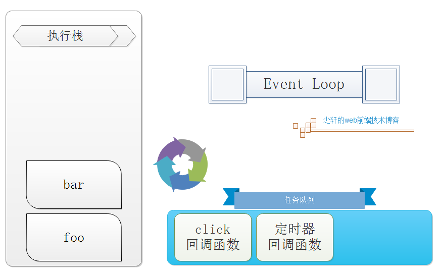
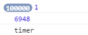
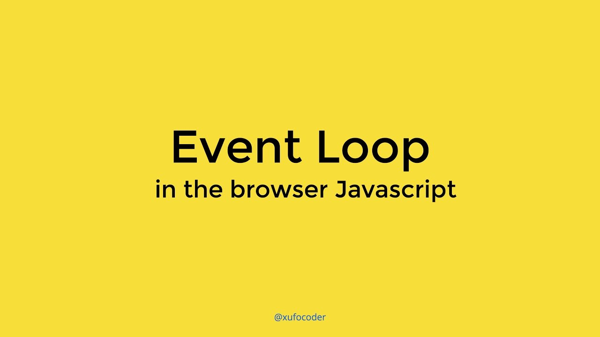
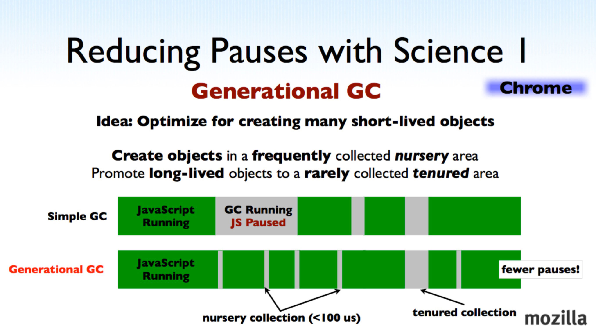
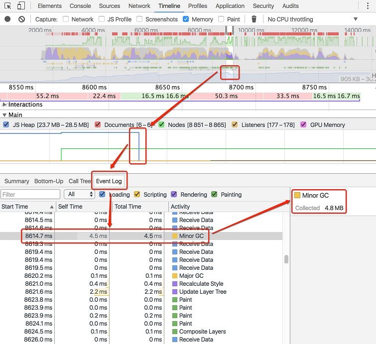

#  Browser

<!-- 🎟🤹‍🤹‍🎭🎬🎼🥁🎸🚗🚌🚁✈️🚀⛵️🚤🛥🛳⛴⛽️🚦🚥🚧🚏🗽🗼🏰🎠
⛱🏖🏝🏜🌋🏂🏋️‍🤸🏻‍🤸🏼‍⛹️‍⛹️‍🤺🏄‍🗝🛍🎁🎊🎉🎀🛍📦🎏📯📄🗞🔈📣
⛺️🗻🗻🏔⛰🏤🏥🌆🌁☎️🎥⏰🛢⚒⛏💎💰💡⌛️💣🔪⚙️💉🌡🛁🛀🏿🔑
🏄‍🏊‍🏊‍🚣‍🏆🚴‍🥇🥈🥉🏅🎖🎗🏵🎫🌊🍎🍋🍓🍇🍉🍅🍆🥝🌽🍖🍗
🐴🐌🐝🐋🐬🐅🐆🐳🐪🐘🐏🕊🐇🐓🦌🐎🐿🐉🐲🌸🌼🌻🌞🌝🍄🌾
🍥🍦🍭🎂🍭🍿🍩🍪🌰🥜🍺🍻☕️🍶🍷🥂🥃🍹🍾🏈🏀🥊⛳️🥋🎋🌱
🔕🔔🔊🗯💭🇨🇳🎍⭐️✨🌈🌚☄️💥🔥☀️🌤⛅️🌥☁️🌦🌧⛈🌩🌨❄️⛲️
🍱🍛 -->

## 1. 浏览器种类


- Chrome / Chromium `WebKit`
- firefox `Gecko`
- Safari `WebKit`
- ie `💥Trident`
- opera `Blink`

## 2. 浏览器组成


1. `用户界面`。包括地址栏、前进/后退按钮、书签菜单等。除了浏览器主窗口显示的您请求的页面外，其他显示的各个部分都属于用户界面。

2. `浏览器引擎`。在用户界面和呈现引擎之间传送指令。
3. `渲染引擎`。负责显示请求的内容。如果请求的内容是 HTML，它就负责解析 HTML 和 CSS 内容，并将解析后的内容显示在屏幕上。
4. `网络层`。用于网络调用，比如 HTTP 请求。其接口与平台无关，并为所有平台提供底层实现。
5. `用户界面后端`。用于绘制基本的窗口小部件，比如组合框和窗口。其公开了与平台无关的通用接口，而在底层使用操作系统的用户界面方法。
6. `JavaScript 解释器。`用于解析和执行 JavaScript 代码。
7. `数据存储。`这是持久层。浏览器需要在硬盘上保存各种数据，例如 Cookie。新的 HTML 规范 (HTML5) 定义了“网络数据库”，这是一个完整（但是轻便）的浏览器内数据库。

::: tip NOTICE

Cookie
localStorage
Session
IndexDb
:::

## 3. 浏览器线程


### 3.1 浏览器中的线程介绍

  通常一个浏览器会至少存在三个线程：`JS引擎线程（用于处理JS）`、`GUI渲染线程（用于页面渲染）`、`浏览器时间触发线程（用于控制交互）`。
  而因为JS可以操作DOM元素，进而会影响到GUI的渲染结果，因此JS引擎线程与GUI渲染线程是互斥的。也就是说当JS引擎线程处于运行状态时，GUI渲染线程将处于冻结状态。
  JS引擎是基于事件驱动，采用的是单线程运行机制。即JS引擎会只会顺序的从任务列表中取任务，并执行。

### 3.2 一般情况下浏览器至少有三个常驻线程

（1）UI线程 `GUI渲染线程（渲染页面)`

（2）JS线程 `JS引擎线程（处理脚本)`

（3）事件(触发)线程 `事件触发线程（控制交互)`

::: tip NOTICE

包括浏览器有时候会开辟新的线程比如用完就扔的Http请求线程（Ajax）等等其他线程
它们共同构成了浏览器的UI线程
这些线程在UI线程的控制下井然有序的工作着
关于这个常驻线程网上观点不一致，各个浏览器实现可能也不一样，这里就不深考究了
虽然我把js引擎线程放在了右下角，但是它是浏览器的主线程
而且`它和GUI渲染线程`是水火不容的，不能够同时工作
`道理很简单，因为它们都要影响DOM，如果 js 线程想要某个DOM的样式，渲染引擎必须停止工作`
:::

🐯🙃🏃🎉⚠️

### 3.3 例子 SetTimeout/SetInternal

::: tip NOTICE
其中 SetTimeout ：在指定的毫秒数后调用指定的代码段；SetInternal：在指定的时间间隔内（ms）循环调用指定的代码段。这两个函数内都涉及到时间计数器，也就是都涉及到一个类似与MFC定时器。JS引擎本身就只能单线程运行，因此定时器需要由其他的外部线程来启动。所以对JS引擎而言，定时器线程可以被视为异步线程。但当定时器时间到达后，所触发的事件则必须在任务列表中排队，等候JS引擎的处理。
:::

  关于setTimeout下面有一个例子，可以帮助深入理解：

```ts
setTimeout(function () { while (true) { } }, 1000);
setTimeout(function () { alert('end 2'); }, 2000);
setTimeout(function () { alert('end 1'); }, 100);
alert('end');
```

 执行的结果是弹出‘end’‘end 1’，然后浏览器假死，就是不弹出‘end 2’。也就是说第一个settimeout里执行的时候是一个死循环，这个直接导致了理论上比它晚一秒执行的第二个settimeout里的函数被阻塞，这个和我们平时所理解的异步函数多线程互不干扰是不符的。


### 3.4 JS单线程

为什么`JavaScript是单线程 单线程就是同一时间只能干一件事`

`那么JavaScript多线程不好吗，那效率多高啊 ? 不好`

::: tip NOTICE

js设计出来就是为了与用户交互，处理DOM 
`如果JavaScript多线程了，那就必须处理多线程同步的问题`（依稀记得曾经被C++线程同步支配的恐怖
`假如js是多线程，同一时间一个线程想要修改DOM，另一个线程想要删除DOM
问题就变得复杂许多，浏览器不知道听谁的，如果引入“锁”的机制，那就麻烦死了（那我就不学前端了(￣_,￣ )`
这样一个`脚本语言`根本没有必要搞得那么复杂，所以`JavaScript诞生起就是单线程执行`
:::

虽然H5提出了`Web Worker`，但是`它不能够操作DOM`，还是要`委托给大哥js主线程解决` 
这些子线程完全受主线程老大控制的（而且受很多限制），实际上`并没有改变JavaScript单线程的本质`

### 3.5 执行栈

我们先来看看什么是执行栈 
栈是`先进后出（FILO）的数据结构`
`执行栈`中存放正在执行的任务，`每一个任务叫做“帧”`
举个例子

```ts
function foo(c){
    var a = 1;
    bar(200);
}
function bar(d){
    var b = 2;
}
foo(100);
```

我们来看看执行栈发生了怎样的变化

- 最开始，代码没有执行的时候，`执行栈为空栈`
- foo函数执行时，创建了一帧，这帧中包含了形参、局部变量（预编译过程），然后把这一帧压入栈中
- 然后执行foo函数内代码，执行bar函数
- 创建新帧，同样有形参、局部变量，压入栈中
- bar函数执行完毕，弹出栈
- foo函数执行完毕，弹出栈
- 执行栈为空

`执行栈其实相当于js主线程（同步顺序执行）`

### 3.6 任务队列

`队列是先入先出（FIFO）的数据结构`
`js线程中还存在着一个任务队列`
任务队列包含了一系列待处理的任务 
`单线程就意味着所有任务需要一个接一个的执行，如果一个任务执行的时间太长，那后面的任务就不得不等着`
::: tip NOTICE

就好比护士阿姨给排队的小朋友打针，如果最前面的小朋友一直滚针，那就一直扎，后面的小朋友就得等着（这比喻好像不恰当）
可是如果最前面的小朋友晕针昏倒了
那么护士阿姨不可能坐那里了等到他醒来，应该先给后面的小朋友扎针
也就是相当于把那位小朋友“挂起”（异步）
:::

所以，任务可以分为两种

- 同步任务
- 异步任务

::: tip NOTICE

`同步任务就是正在主线程执行栈中执行的任务（在屋子内打针的小朋友）`
`而异步任务是在任务队列等候处理的任务（在屋子外等候打针的小朋友）`
一旦执行栈中没有任务了，它就会从`执行队列`中获取任务执行
:::

### 3.6 事件与回调

`任务队列是一个事件的队列`，IO设备（输入/输出设备）每完成一项任务，就会在`任务队列中添加事件处理`
用户`触发了事件`，也同样会`将回调添加到任务队列中去`
主线程执行`异步任务`，便是`执行回调函数（事件处理函数）`
只要执行栈一空，排在执行队列前面的处理函数便会被优先读取执行
`不过主线程会检查时间，某些事件需要到了规定时间才能进入主线程处理（定时器事件）`

### 3.7 简述 事件循环(Event Loop)

`Event Loop`


`主线程从执行队列不断地获取任务，这个过程是循环不断地，叫做“Event Loop”事件循环
同步任务总是会在异步任务之前执行
只有当前的脚本执行完，才能够去拿任务队列中的任务执行
前面也说到了，任务队列中的事件可以是定时器事件
定时器分为两种 setTimeout() 和 setInterval()
前者是定时执行一次，后者定时重复执行 
第一个参数为执行的回调函数，第二个参数为间隔时间（ms）`
来看这样一个例子

```ts
setTimeout(function(){
    console.log('timer');
}, 1000);
console.log(1);
console.log(2);
console.log(3);
```

这个没什么问题，浏览器打印的是

```ts
1 2 3 timer
```

但是这样呢

```ts
setTimeout(function(){
    console.log('timer');
}, 0);//0延时
console.log(1);
console.log(2);
console.log(3);
```

浏览器打印依然打印的是 `1 2 3 timer`
也许有同学知道，旧版浏览器，setTimeout定时至少是10ms（即便你设置了0ms），
`H5新规范是定时至少4ms`，改变`DOM也是至少16ms`
我们可以暂且认为是这个原因
那么我再改动一下代码

```ts
setTimeout(function(){
    console.log('timer');
}, 0);
var a = +new Date();
for(var i = 0; i < 1e5; i++){
    console.log(1);
}
var b = +new Date();
console.log(b - a);
```

这回够刺激了吧，输出10w次，我浏览器都假死了（心疼我chrome） 
不仅如此，我还打印了循环所用时间 
来看看控制台



输出了10w个1，用了将近7s
timer依然在最后打印
这就证明了我前面说的话: 同步任务总是会在异步任务之前执行 
只有我执行栈空了，才会去你任务队列中取任务执行

实例
最后我举一个例子加深一下理解

```ts
demo.onclick = function(){
    console.log('click');
}
function foo(a){
    var b = 1;
    bar(200);
}
function bar(c){
    var d = 2;
    click//伪代码 此时触发了click事件（这里我假装程序运行到这里手动点击了demo）
    setTimeout(function(){
        console.log('timer');
    }, 0);
}
foo(100);
```

怕大家蒙我就不写Ajax了
Ajax如果处理结束后（通过Http请求线程），也会将回调函数放在任务队列中
还有一点 click 那一行伪代码我最开始是想用demo.click()模拟触发事件
后来在测试过程中，发现它好像跟真实触发事件不太一样
它应该是不通过触发事件线程，而是存在于执行栈中，就相当于单纯地执行click回调函数
不过这只是我自己的想法有待考证，不过这不是重点，重点是我们理解这个过程，请大家不要吐槽我╰(￣▽￣)╭

下面看看执行这段代码时发生了什么（主要说栈和队列的问题，不会赘述预编译过程）

- 主线程开始执行，产生了栈、堆、队列
- demo节点绑定了事件 click ，交给事件触发线程异步监听
- 执行foo函数（之前同样有预编译过程），创建了帧包括foo函数的形参、局部变量压入执行栈中
- foo函数内执行 bar 函数，创建帧包括bar函数的形参、局部变量压入执行栈中
- 触发了click事件，事件触发线程将回调事件处理函数放到js线程的任务队列中
- 触发了定时器事件，事件触发线程立即（4ms）将回调处理函数放到 js 线程的任务队列中bar函数执行完毕，弹出栈
- foo函数执行完毕，弹出栈
- 此时执行栈为空
- 执行栈向任务队列中获取一个任务执行：click回调函数，输出‘click’
- 执行栈向任务队列中获取一个任务执行：定时器回调函数，输出‘timer’
- 执行结束
- 这里从任务队列里不断取任务的过程就是Event Loop

## 4. 🐯JS 事件循环详解



`大量摘抄`


### 4.1 JS 事件循环前言

这一次，彻底弄懂 JavaScript 执行机制
本文的目的就是要保证你彻底弄懂javascript的执行机制，如果读完本文还不懂，可以揍我。

不论你是javascript新手还是老鸟，不论是面试求职，还是日常开发工作，我们经常会遇到这样的情况：给定的几行代码，我们需要知道其输出内容和顺序。因为javascript是一门单线程语言，所以我们可以得出结论：

javascript是按照语句出现的顺序执行的
看到这里读者要打人了：我难道不知道js是一行一行执行的？还用你说？稍安勿躁，正因为js是一行一行执行的，所以我们以为js都是这样的：

```ts
let a = '1';
console.log(a);

let b = '2';
console.log(b);
```

然而实际上js是这样的：


```ts
setTimeout(function(){
    console.log('定时器开始啦')
});

new Promise(function(resolve){
    console.log('马上执行for循环啦');
    for(var i = 0; i < 10000; i++){
        i == 99 && resolve();
    }
}).then(function(){
    console.log('执行then函数啦')
});

console.log('代码执行结束');
```


依照js是`按照语句出现的顺序`执行这个理念，我自信的写下输出结果：

```ts
//"定时器开始啦"
//"马上执行for循环啦"
//"执行then函数啦"
//"代码执行结束"
```

去chrome上验证下，结果完全不对，瞬间懵了，说好的一行一行执行的呢？


我们真的要彻底弄明白javascript的执行机制了。

### 4.2 主要执行顺序

::: tip NOTICE

`宏任务 --> 微任务 --> 宏任务 -->  微任务 -->[]`

:::

- macro-task(宏任务)：包括`整体代码script，setTimeout，setInterval, new Promise`
- micro-task(微任务)：`Promise.then，process.nextTick`
- ⚠️`主要代码结构就是宏任务` 之后`执行微任务`

### 4.3 关于javascript

javascript是一门单线程语言，在最新的HTML5中提出了Web-Worker，但javascript是单线程这一核心仍未改变。所以一切javascript版的"多线程"都是用单线程模拟出来的，一切javascript多线程都是纸老虎！

### 4.4 javascript事件循环

既然js是单线程，那就像只有一个窗口的银行，客户需要排队一个一个办理业务，同理js任务也要一个一个顺序执行。如果一个任务耗时过长，那么后一个任务也必须等着。那么问题来了，假如我们想浏览新闻，但是新闻包含的超清图片加载很慢，难道我们的网页要一直卡着直到图片完全显示出来？因此聪明的程序员将任务分为两类：

- 同步任务
- 异步任务

当我们打开网站时，网页的渲染过程就是一大堆同步任务，比如页面骨架和页面元素的渲染。而像加载图片音乐之类占用资源大耗时久的任务，就是异步任务。关于这部分有严格的文字定义，但本文的目的是用最小的学习成本彻底弄懂执行机制，所以我们用导图来说明：


导图要表达的内容用文字来表述的话：

- 同步和异步任务分别进入不同的执行"场所"，同步的进入主线程，异步的进入Event Table并注册函数。
- 当指定的事情完成时，Event Table会将这个函数移入 Event Queue。
- 主线程内的任务执行完毕为空，会去Event Queue读取对应的函数，进入主线程执行。
- 上述过程会不断重复，也就是常说的Event Loop(事件循环)。

我们不禁要问了，那怎么知道主线程执行栈为空啊？js 引擎存在 monitoring process进程，会持续不断的检查主线程执行栈是否为空，一旦为空，就会去Event Queue那里检查是否有等待被调用的函数。

说了这么多文字，不如直接一段代码更直白：

```ts
let data = [];
$.ajax({
    url:www.javascript.com,
    data:data,
    success:() => {
        console.log('发送成功!');
    }
})
console.log('代码执行结束');
```

上面是一段简易的ajax请求代码：

1. `ajax`进入Event Table，注册`回调函数success`。
2. 执行console.log('代码执行结束')。
3. ajax事件完成，回调函数 success 进入Event Queue。
4. 主线程从Event Queue 读取回调函数 success 并执行。

>相信通过上面的文字和代码，你已经对js的执行顺序有了初步了解。接下来我们来研究进阶话题：setTimeout。

### 4.5 又爱又恨的 setTimeout

>大名鼎鼎的setTimeout无需再多言，大家对他的第一印象就是异步可以延时执行，我们经常这么实现延时3秒执行：

```ts
setTimeout(() => {
    console.log('延时3秒');
},3000)
```

渐渐的setTimeout用的地方多了，问题也出现了，有时候明明写的延时3秒，实际却5，6秒才执行函数，这又咋回事啊？

先看一个例子：

```ts
setTimeout(() => {
    task();
},3000)
console.log('执行console');
```

- 根据前面我们的结论，setTimeout是异步的，应该先执行console.log这个同步任务，所以我们的结论是：

```ts
//执行console
//task()
```

- 去验证一下，结果正确！然后我们修改一下前面的代码：

```ts
setTimeout(() => {
    task()
},3000)

sleep(10000000)
```

乍一看其实差不多嘛，但我们把这段代码在chrome执行一下，却发现控制台执行task()需要的时间远远超过3秒，说好的延时三秒，为啥现在需要这么长时间啊？

这时候我们需要重新理解setTimeout的定义。我们先说上述代码是怎么执行的：

`Important`

- `task()`进入`Event Table`并注册,计时开始。
- 执行`sleep`函数，很慢，非常慢，计时仍在继续。
- 3秒到了，计时事件`timeout`完成，task()进入`Event Queue`，但是`sleep也太慢了吧，还没执行完，只好等着。`
- `sleep终于执行完`了，`task()`终于从Event Queue进入了主线程执行。

上述的流程走完，我们知道`setTimeout`这个函数，是经过指定时间后，把要执行的任务(本例中为task())加入到Event Queue中，`又因为是单线程任务要一个一个执行，如果前面的任务需要的时间太久，那么只能等着，导致真正的延迟时间远远大于3秒`。

我们还经常遇到`setTimeout(fn,0)`这样的代码，0秒后执行又是什么意思呢？是不是可以立即执行呢？

答案是不会的，`setTimeout(fn,0)的含义是，指定某个任务在主线程最早可得的空闲时间执行，意思就是不用再等多少秒了，只要主线程执行栈内的同步任务全部执行完成，`栈为空就马上执行。举例说明：

```ts
//代码1
console.log('先执行这里');
setTimeout(() => {
    console.log('执行啦')
},0);
//代码2
console.log('先执行这里');
setTimeout(() => {
    console.log('执行啦')
},3000);
```

代码1的输出结果是：

```ts
//先执行这里
//执行啦
```

代码2的输出结果是：

```ts
//先执行这里
// ... 3s later
// 执行啦
```

关于setTimeout要补充的是，即便主线程为空，0毫秒实际上也是达不到的。根据HTML的标准，`最低是4毫秒`。有兴趣的同学可以自行了解。

### 4.6 又恨又爱的setInterval

上面说完了setTimeout，当然不能错过它的孪生兄弟setInterval。他俩差不多，只不过后者是循环的执行。
`对于执行顺序来说，setInterval会每隔指定的时间将注册的函数置入 Event Queue`，如果前面的任务耗时太久，那么同样需要等待。

唯一需要注意的一点是，对于`setInterval(fn,ms)`来说，我们已经知道`不是每过 ms秒会执行一次 fn，而是每过 ms秒，会有 fn进入 Event Queue`。一旦setInterval的回调函数`fn`执行时间超过了`延迟时间ms`，那么就完全`看不出来有时间间隔了`。这句话请读者仔细品味。

让我们想象一个意外情况，比如说下面的setInterval

```ts
setInterval(function () {
    func(i++);
}, 100)
```

我们每100毫秒调用一次func函数，如果func的执行时间少于100毫秒的话，在遇到下一个100毫秒前就能够执行完：


但如果func的执行时间大于100毫秒，该触发下一个func函数时之前的还没有执行完怎么办？答案如下图所示，那么第二个func会在队列（这里的队列是指event loop）中等待，直到第一个函数执行完


如果第一个函数的执行时间特别长，在执行的过程中本应触发了许多个func怎么办，那么所有这些应该触发的函数都会进入队列吗？

不，只要发现队列中有一个被执行的函数存在，那么其他的统统忽略。如下图，在第300毫秒和400毫秒处的回调都被抛弃，一旦第一个函数执行完后，接着执行队列中的第二个，即使这个函数已经“过时”很久了。


还有一点，虽然你在setInterval的里指定的周期是100毫秒，但它并不能保证两个函数之间调用的间隔一定是一百毫秒。在上面的情况中，如果队列中的第二个函数时在第450毫秒处结束的话，在第500毫秒时，它会继续执行下一轮func，也就是说这之间的间隔只有50毫秒，而非周期100毫秒

### 4.7 Promise.then与 process.nextTick(cb)

传统的定时器我们已经研究过了，接着我们探究 Promise与 process.nextTick(callback)的表现。

Promise的定义和功能本文不再赘述，不了解的读者可以学习一下阮一峰老师的Promise。而process.nextTick(callback)类似node.js版的"setTimeout"，在事件循环的下一次循环中调用 callback 回调函数。

### 4.8 宏任务和微任务

> `我们进入正题，除了广义的同步任务和异步任务，我们对任务有更精细的定义：`

- macro-task(宏任务)：包括**整体代码script，setTimeout，setInterval, `new Promise`**
- micro-task(微任务)：Promise.then，process.nextTick

不同类型的任务会进入对应的`Event Queue`，比如`setTimeout`和`setInterval`会进入相同的Event Queue。

事件循环的顺序，决定js代码的执行顺序。进入整体代码(宏任务)后，开始第一次循环。接着执行所有的微任务。然后再次从宏任务开始，找到其中一个任务队列执行完毕，再执行所有的微任务。听起来有点绕，我们用文章最开始的一段代码说明：

```ts
setTimeout(function() {
    console.log('setTimeout');
})

new Promise(function(resolve) {
    console.log('promise');
}).then(function() {
    console.log('then');
})

console.log('console');
```

1. 这段代码作为宏任务，进入主线程。
2. 先遇到setTimeout，那么将其回调函数注册后分发到宏任务Event Queue。(注册过程与上同，下文不再描述)
3. 接下来遇到了Promise，new Promise立即执行，then函数分发到微任务 Event Queue。
4. 遇到console.log()，立即执行。
5. 好啦，整体代码script作为第一个宏任务执行结束，看看有哪些微任务？我们发现了 then在微任务 Event Queue里面，执行。
6. ok，第一轮事件循环结束了，我们开始第二轮循环，当然要从宏任务Event Queue开始。我们发现了宏任务`Event Queue`中setTimeout对应的回调函数，立即执行。
7. 结束。

事件循环，宏任务，微任务的关系如图所示：


### 4.9 实战分析

```ts
console.log('1');

setTimeout(function() {
    console.log('2');
    process.nextTick(function() {
        console.log('3');
    })
    new Promise(function(resolve) {
        console.log('4');
        resolve();
    }).then(function() {
        console.log('5')
    })
})
process.nextTick(function() {
    console.log('6');
})
new Promise(function(resolve) {
    console.log('7');
    resolve();
}).then(function() {
    console.log('8')
})

setTimeout(function() {
    console.log('9');
    process.nextTick(function() {
        console.log('10');
    })
    new Promise(function(resolve) {
        console.log('11');
        resolve();
    }).then(function() {
        console.log('12')
    })
})
```

#### 4.9.1 第一轮事件循环

1. 整体script作为第一个宏任务进入主线程，遇到console.log，输出1。
2. 遇到setTimeout，其回调函数被分发到宏任务Event Queue中。我们暂且记为setTimeout1。
3. 遇到process.nextTick()，其回调函数被分发到微任务Event Queue中。我们记为process1。
4. 遇到Promise，new Promise直接执行，输出7。then被分发到微任务 `Event Queue`中。我们记为then1。
5. 又遇到了setTimeout，其回调函数被分发到宏任务Event Queue中，我们记为setTimeout2。
6. 宏任务Event Queue 微任务 Event Queue
7. setTimeout1 process1
8. setTimeout2 then1
9. 上表是第一轮事件循环宏任务结束时各Event Queue的情况，此时已经输出了1和7。
10. 我们发现了`process1和then1两个微任务`。
11. 执行process1,输出6。
12. 执行then1，输出8。

#### 4.9.2 第二轮事件循环

好了，第一轮事件循环正式结束，这一轮的结果是输出1，7，6，8。那么第二轮时间循环从setTimeout1宏任务开始：

1. 首先输出2。接下来遇到了process.nextTick()，同样将其分发到微任务 Event Queue中，记为process2。new Promise立即执行输出4，then也分发到微任务 Event Queue中，
记为then2。

| 宏任务Event Queue | 微任务Event Queue |
| :-: | :-:|
| setTimeout2 | process2 |
|setTimeout2| then1|

2. 第二轮事件循环宏任务结束，我们发现有process2和then2两个微任务可以执行。
3. 输出3。
4. 输出5。
5. 第二轮事件循环结束，第二轮输出2，4，3，5。

#### 4.9.3 第三轮事件循环

1. 第三轮事件循环开始，此时只剩setTimeout2了，执行。
2. 直接输出9。
3. 将process.nextTick()分发到微任务Event Queue中。记为process3。
4. 直接执行new Promise，输出11。
5. 将then分发到微任务 Event Queue中，记为then3。

| 宏任务Event Queue|微任务Event Queue|
|:-:|:-: |
||process3|
|| then3|

6. 第三轮事件循环宏任务执行结束，执行两个微任务process3和then3。
7. 输出10。
8. 输出12。
9. 第三轮事件循环结束，第三轮输出9，11，10，12。

#### 4.9.4 循环结束

 整段代码，共进行了三次事件循环，完整的输出为1，7，6，8，2，4，3，5，9，11，10，12。

(请注意，node环境下的事件监听依赖 libuv与前端环境不完全相同，输出顺序可能会有误差)

#### 4.10 写在最后

(1)js的异步
我们从最开头就说javascript是`一门单线程`语言，不管是什么`新框架新语法糖实现的所谓异步，其实都是用同步的方法去模拟的，牢牢把握住单线程这点非常重要`。

(2)事件循环Event Loop
事件循环是js实现异步的一种方法，也是js的执行机制。

(3)javascript的执行和运行
执行和运行有很大的区别，javascript在不同的环境下，比如node，浏览器，Ringo等等，执行方式是不同的。而运行大多指javascript解析引擎，是统一的。

(4)setImmediate
微任务和宏任务还有很多种类，比如setImmediate等等，执行都是有共同点的，有兴趣的同学可以自行了解。

#### 4.11 最后的最后

**`javascript是一门单线程语言`**
**`Event Loop 是 javascript 的执行机制`**
>牢牢把握两个基本点，以认真学习javascript为中心，早日成为像我一样的大牛

**`皮一下, 很开心`**

## 5. ❤️浏览器存储


### 5.1 Cookie

Cookie 是小甜饼的意思。顾名思义，cookie 确实非常小，它的大小限制为`4KB`左右，是网景公司的前雇员 Lou Montulli 在1993年3月的发明。它的主要用途有`保存登录信息`，比如你登录某个网站市场可以看到“记住密码”，这通常就是通过在 Cookie 中存入一段辨别用户身份的数据来实现的。

### 5.2 localStorage

localStorage 是 HTML5 标准中新加入的技术，它并不是什么划时代的新东西。早在 IE 6 时代，就有一个叫 userData 的东西用于本地存储，而当时考虑到浏览器兼容性，更通用的方案是使用 Flash。而如今，localStorage 被大多数浏览器所支持，如果你的网站需要支持 IE6+，那以 userData 作为你的 polyfill 的方案是种不错的选择。

### 5.3 sessionStorage

sessionStorage 与 localStorage 的接口类似，但`保存数据的生命周期与 localStorage 不同`。做过后端开发的同学应该知道 Session 这个词的意思，直译过来是“`会话`”。而 sessionStorage 是一个前端的概念，它只是可以将一部分数据在当前会话中保存下来，`刷新页面数据依旧存在`。但当页面关闭后，sessionStorage 中的数据就会被清空。

### 5.4 三者的异同

|特性      |    Cookie |  localStorage   |sessionStorage   |
| :-------- | :--------| :------ |:------ |
| 数据的生命期| 一般由服务器生成，可设置失效时间。如果在浏览器端生成Cookie，默认是关闭浏览器后失效| 除非被清除，否则永久保存| 仅在当前会话下有效，关闭页面或浏览器后被清除|
| 存放数据大小| 4K左右| 一般为5MB|  一般为5MB|
| 与服务器端通信| 每次都会携带在HTTP头中，如果使用cookie保存过多数据会带来性能问题| 仅在客户端（即浏览器）中保存，不参与和服务器的通信|  仅在客户端（即浏览器）中保存，不参与和服务器的通信|
| 易用性| 需要程序员自己封装，源生的Cookie接口不友好| 源生接口可以接受，亦可再次封装来对 Object和 Array有更好的支持| 源生接口可以接受，亦可再次封装来对 Object和 Array有更好的支持|
| 作用域大小| 同域| 同域| 同域 |
| 数据结构 | key-value(字符创-字符串)| key-value| key-value|

### 5.5 应用场景

有了对上面这些差别的直观理解，我们就可以讨论三者的应用场景了。

因为考虑到每个 HTTP 请求都会带着 Cookie 的信息，所以 Cookie 当然是能精简就精简啦，比较常用的一个应用场景就是判断用户是否登录。针对登录过的用户，服务器端会在他登录时往 Cookie 中插入一段加密过的唯一辨识单一用户的辨识码，下次只要读取这个值就可以判断当前用户是否登录啦。曾经还使用 Cookie 来保存用户在电商网站的购物车信息，如今有了 localStorage，似乎在这个方面也可以给 Cookie 放个假了~

而另一方面 localStorage 接替了 Cookie 管理购物车的工作，同时也能胜任其他一些工作。比如HTML5游戏通常会产生一些本地数据，localStorage 也是非常适用的。如果遇到一些内容特别多的表单，为了优化用户体验，我们可能要把表单页面拆分成多个子页面，然后按步骤引导用户填写。这时候 sessionStorage 的作用就发挥出来了。

### 5.6 Web Storage API

localStorage 和 sessionStorage 有着统一的API接口，这为二者的操作提供了极大的便利。下面以
`localStorage 为例来介绍一下 API 接口使用方法，同样这些接口也适用sessionStorage`

#### 5.6.1 添加键值对 localStorage.setItem(key, value)

添加键值对：`localStorage.setItem(key, value)`setItem 用于把值 value 存储到键key上，除了使用 setItem ，还可以使用
`localStorage.key = value` 或者 `localStorage['key'] = value`这两种形式。
另外需要注意的是，key和value值必须是字符串形式的，如果不是字符串，会调用它们相应的toString() 方法来转换成字符串再存储。
当我们要存储对象是，应先转换成我们可识别的字符串格式（比如JSON格式）再进行存储。

```ts
// 把一个用户名 ( lilei )存储到 name 的键上
localStorage.setItem('name', 'lilei');
// localStorage.name = 'lilei';
// localStorage['name'] = 'lilei';
// 把一个用户存储到user的键上
localStorage.setItem('user', JSON.stringify({id:1, name:'lilei'}));
```

#### 5.6.2 获取键值：localStorage.getItem(key)

获取键值：`localStorage.getItem(key)`
getItem 用于获取键 key 对应的数据，和 setItem 一样，getItem 也有两种等效形式
`value = localStorage.key和 value = localStorage['key']`。
获取到的 value 值是字符串类型，如果需要其他类型，要做手动的类型转换。

```ts
// 获取存储到 name 的键上的值
var name = localStorage.getItem('name');
// var name = localStorage.name;
// var name = localStorage['name'];
// 获取存储到user的键上的值
var user = JSON.parse(localStorage.getItem('user'));
```

#### 5.6.3 删除键值对: localStorage.removeItem(key)

删除键值对：`localStorage.removeItem(key)` removeItem 用于删除指定键的项，
localStorage `没有数据过期`的概念，所有数据如果失效了，需要开发者手动删除。

```ts
 var name = localStorage.getItem('name'); // 'lilei'
 // 删除存储到 name 的键上的值
 localStorage.removeItem('name');
 name = localStorage.getItem('name'); // null
```

#### 5.6.4 清除所有键值对: localStorage.clear()

清除所有键值对：localStorage.clear()clear 用于删除所有存储的内容，
它和 removeItem不同的地方是 removeItem 删除的是某一项，而clear是删除所有。

```ts
// 清除 localStorage
localStorage.clear();
var len = localStorage.length; // 0
```

#### 5.6.5 获取 localStorage 的属性名称(键名称)：localStorage.key(index)

获取 localStorage 的属性名称(键名称)：localStorage.key(index)key 方法用于获取指定索引的键名称。需要注意的是`赋值早的键值对应的索引值大，赋值晚的键值对应的索引小,` key方法可用于遍历 localStorage 存储的键值。

``` ts
localStorage.setItem('name','lilei');
var key = localStorage.key(0); // 'name'
localStorage.setItem('age', 10);
key = localStorage.key(0); // 'age'
key = localStorage.key(1); // 'name'
```

#### 5.6.6 获取 localStorage 中保存的键值对的数量：localStorage.length

获取 localStorage 中保存的键值对的数量：localStorage.length length 属性用于获取 localStorage 中键值对的数量。

```ts
localStorage.setItem('name','lilei');
var len = localStorage.len; // 1
localStorage.setItem('age', 10);
len = localStorage.len; // 2
```

### 5.7 🚥Web Storage 事件

`storage 事件当存储的数据发生变化时，会触发 storage 事件`。
但要注意的是它不同于click类的事件会`事件捕获和冒泡`，`storage 事件更像是一个通知，不可取消。`
触发这个事件会调用`同域`下其他窗口的storage事件，不过触发`storage的窗口（即当前窗口）不触发这个事件(chrome 好像可以❤️)`
`🚥(可用于多页面通信)`storage 的 `event` 对象的常用属性如下：

```ts
oldValue：更新前的值。如果该键为新增加，则这个属性为null。
newValue：更新后的值。如果该键被删除，则这个属性为null。
url：原始触发storage事件的那个网页的网址。
key：存储 store的 key名
```

```ts
function storageChanged(/*event */) {
    console.log(arguments);
}

window.addEventListener('storage', storageChanged, false);
```

### 5.8 indexDb

>IndexedDB 可以存储非常多的数据，比如 Object,files,blobs 等，里面的存储结构是根据 Database 来进行存储的。每个 DB 里面可以有不同的 object stores。

1. 持久存储
2. 不适合过大的数据存储，浏览器对 indexDB 有 50M 大小的限制
3. 不适合对兼容性要求高的项目
4. 不适合存储敏感数据
5. 当用户清除浏览器缓存的时候可能出现问题
6. indexedDB 受到同源策略的限制

## 6. 浏览器从输入URL 到页面展示都发生了什么


### 6.1 核心


>概述


```ts

1.浏览器查找域名的 IP 地址

2.这一步包括 DNS 具体的查找过程，包括：浏览器缓存->系统缓存->路由器缓存>IP 根服务器>找到指定Ip

3.浏览器向 web 服务器发送一个 HTTP 请求

4.服务器的永久重定向响应（从 http://example.com 到 http://www.example.com）

5.浏览器跟踪重定向地址

6.服务器处理请求

7.服务器返回一个 HTTP 响应

8.浏览器显示 HTML

9.浏览器发送请求获取嵌入在 HTML 中的资源（如图片、音频、视频、CSS、JS等等）

10.浏览器发送异步请求

```

### 6.2 DNS && IP

1. 查询 域名
2. 浏览器缓存
3. 系统缓存
4. 路由器缓存
5. 域名服务器
6. 找到指定Ip

### 6.3 发送 HTTP 请求

1. 三次握手
2. 建立连接
3. 正常数据交换

### 6.4 资源解析

HTTP 请求返回的 HTML 传递到浏览器后，如果有 gzip 会先解压，然后接下来最重要的问题是要知道它的编码是什么，比如同样一个「中」字，在 UTF-8 编码下它的内容其实是「11100100 10111000 10101101」也就是「E4 B8 AD」，而在 GBK 下则是「11010110 11010000」，也就是「D6 D0」，如何才能知道文件的编码？可以有很多判断方法：

1. 用户设置，在浏览器中可以指定页面编码
2. HTTP 协议中
3. `<meta>`中的 charset 属性值
4. 对于 JS 和 CSS
5. 对于 iframe

如果在这些地方都没指明，浏览器就很难处理，在它看来就是一堆「0」和「1」，比如「中文」，它在 UTF-8 下有 6 个字节，如果按照 GBK 可以当成「涓枃」这 3 个汉字来解释，浏览器怎么知道到底是「中文」还是「涓枃」呢？

不过正常人一眼就能认出「涓枃」是错的，因为这 3 个字太不常见了，所以有人就想到通过判断常见字的方法来检测编码，典型的比如 Mozilla 的 UniversalCharsetDetection，不过这东东误判率也很高，所以还是指明编码的好。

这样后续对文本的操作就是基于「字符」(Character)的了，一个汉字就是一个字符，不用再关心它究竟是 2 个字节还是 3 个字节。

### 6.5 浏览器渲染

1. 解析 HTML 形成 DOM Tree
2. 解析CSS 形成 CSSOM Tree
3. DOM  & CSSOM 形成Render Tree
4. 利用 浏览器渲染引擎进行渲染
5. Paint 首先进行 paint (绘制) 根据页面的 DOM 和  CSSOM 进行元素的位置的确定和绘制
6. Reflow 进行页面局部位置的回流 主要是颜色 背景边框等视觉因素的样式绘制.
7. Display 显示整个页面

## 7. BOM


>BOM 为浏览器窗口对象的一组 API。


### 7.1 `用于操作浏览器的API`

> ⚠️通过window 或者省略window 或者document 或者 event 鼠标事件

```ts
BOM是 browser object model的缩写，简称浏览器对象模型
BOM提供了独立于内容而与浏览器窗口进行交互的对象
由于BOM主要用于管理窗口与窗口之间的通讯，因此其核心对象是window
BOM由一系列相关的对象构成，并且每个对象都提供了很多方法与属性
BOM缺乏标准，JavaScript语法的标准化组织是 ECMA，DOM的标准化组织是 W3C
BOM最初是 Netscape 浏览器标准的一部分
```

### 7.2 BOM

```ts
属性
    navigator
    location
方法
    history
方法
    screen

Window 方法
Window 事件
```

- 面试🙃🙃

```ts
window.onload 和 document.onload
document.onload 是dom 解析完成就会触发
window.onload
```

### 7.3 🎉常用API

- 粗略的过了一遍MDN上的BOM属性，记录部分常用的BOM API

```ts
1. window.history
    操纵浏览器记录

    history.back();     // 等同于点击浏览器的回退按钮
    history.go(-1);     //等同于history.back()

2.🐯 window.innerHeight/innerWidth vs  window.outerWidth/outerHeight
    浏览器窗口的视口（viewport）高宽 vs 获取完整窗口大小：

3. 🐯window.location
    操作刷新按钮和地址栏

    设置或取得当前 URL 的主机名称和端口
  
  `http://www.baidu.com:80/qs/ans` //  http://www.baidu.com:80

5. location.pathname [string]
    设置或取得当前 URL 的路径部分

🐯6. location.search [string]
    查询或设置当前URL的?号开始的字符串

🐯7.location.href
    返回整个URL

8. location.hash
    返回或设置#号开始的部分

9. location.origin
    返回当前域名

10. window.navigator
    只读对象

11. window.screen
    返回有关屏幕大小宽高以及颜色深度等信息

    screen.availWidth | 可用的屏幕宽度
    screen.availHeight | 可用的屏幕宽度
    screen.width | 当前屏幕宽度 (分辨率)
    screen.height | 当前屏幕高度 (分辨率值)
    screen.colorDepth | 当前屏幕色彩深度(bit)

12. navigator.userAgent 
    获得HTTP请求的用户带头的值

13. window.self
    即window 尽量少使用全局变量!!

14. window.top
     返回最顶层页面

15. window.resizeTo(width,height)
    resizeBy(width/height)增量

16. event 事件位置

    参照屏幕左上角: e.screenX, e.screenY
    参照文档显示区左上角: e.clientX||e.x , e.clientY||e.y
    参照所在父元素的左上角: e.offsetX , e.offsetY

17.  location.replace(“url”) 当前页面打开不可后退⚠️
    location.replace vs history.replaceState⚠️

18. ⚠️重新加载当前页面: location.reload(false/true/'') location.reload()
    document.location.reload() vs location.reload()

19.定时器一次性： clearInterval(timer);time=null
    定时器周期性：  clearTimeout(timer);time=null

20. ️[btn/window].addEventListener(“事件名”，函数对象[命名函数, 匿名函数无法取消会造成泄漏])


21. ️[btn/window].remove(“事件名”，函数对象[命名函数, 匿名函数无法取消会造成泄漏])

22. 阻止冒泡：
  e.stopPropagation(); e.cancelBubble[ie⚠️]

23. 取消事件（阻止默认行为）：
    e.preventDefault

24. 创建cookie:
    document.cookie="变量名=值;expires="+new Date().toGMTString();
```

### 7.4 location

```ts
http://www.github.com:8080/index.html?user=li-xinyang&lang=zh-CN#home
    |          |          |       |                  |              |
    protocol   |          |       |                  |              |
              hostname     port   |                  |              |
                \        /    pathname             search          hash
                    host
4. location.host [string]
```

### 7.5 Window 方法

|方法      |    方法描述 |
| :--------: | :--------:|
| alert(), confirm() 返回真假, prompt() 返回用户输入值  | 三种对话框|
| setTimeout(), setInterval()|  计时器|
| open(), | close() | 开启窗口，关闭窗口|
::: tip 提示
NOTE：`对话框会阻塞线程。`
:::

```ts
打开或关闭窗口

var w = window.open('subwindow.html', 'subwin', 'width=300, height=300, status=yes, resizable=yes');

// 既可关闭窗口
w.close();

```

### 7.6 Window 事件

|方法      |    方法描述 |
| :--------: | :--------|
|load   |文档和所有图片完成加载时|
|unload|    离开当前文档时|
|beforeunload|和 unload 类似，但是它提供询问用户是否确认离开的机会|
|resize|    拖动改变浏览器窗口大小时|
|scroll|    拖动浏览器时|

### 7.7 浏览器事件


**专用事件：** `window对象-事件`

`onload`事件：我们需要在网页文档`下载完毕(所有资源)`时执行的程序代码，需要放在onload事件处理程序中去编写。

`onunload`事件：在网页文档`卸载`完毕后，需要在`网页关闭时执行`的程序代码，需要放在onunload事件处理程序中去编写。

`onbeforeunload`事件：对于浏览器准备卸载网页文件时的事件，也就是onbeforeunload事件是发生在卸载网页文件之前的事件，给用户提供一个取消的机会。

样例：

```ts
<body onload="alert('欢迎')" onunload="alert('再见!')"  onbeforeunload="window.event.returnValue='请小心'">
</body>
```

效果：打开网页，弹出一个“欢迎”的对话框，点击右上角的叉叉，弹出是否关闭网页的对话框，选择“确定”，网页关闭，弹出一个“再见”的对话框。

```ts
// 测试javascript语句的执行顺序：
<script>
   alert("ok");
</script>
<body onload="alert('欢迎')" onunload="alert('再见!')"
    onbeforeunload="window.event.returnValue='请小心'">
Hello
<script>
   alert("ok2");
</script>
</body>
<script>
   alert("ok3");
</script>
```

这个例子说明了，解析器是`一边读文档`，`一边解析里面的内容`。而`onload事件发生在浏览器将程序装载完才发生`的事件。
如果网页文档非常大，装载的时间非常长，为了缓解用户等待的焦急心情，可以在开始放一个`script`语句块，显示`"正在下载"`，然后在中间的`script语句块中放一个定时器，显示下载进度`。在最后显示装在完毕的信息。

**通用事件：** `鼠标和按键`

- `onclick事件`：它是当用户`点击某个Html元素时产生的事件`。我们在 form表单的元素中经常使用到 onclick事件。

- `onmousemove`事件：它是当鼠标在`某个html元素上移动`的时候所产生的事件，这个事件伴随着鼠标的移动而不断的重复发生。如果我们要随着鼠标的移动而不断显示出鼠标的新坐标位置，就应该处理这个事件。

- `onmouseover事件`：它是指鼠标刚从外面移`进到一个html元素的边界`时，所产生的事件。除非鼠标又移出html元素且再移入，否则这个事件不会重复发生。

- `onmouseout事件`：它是`当鼠标移出一个html元素的边界时`所产生的事件。

- `onmousedown事件`：当`鼠标的任何按键按下去`的时候产生的事件。

- `onmouseup事件`：当`鼠标的任何按键弹起去`的时候产生的事件。

- `onkeydown`：当键盘的任何按键`按下`去的时候产生的事件。

- `onkeyup事件`：当键盘的`任何按键弹起的时候`产生的事件。

- `onkeypress事件`：当用户`按下一个数字或字母按键`所产生的事件。`按某个键是指"按下弹起"。`

- `TBD....`

## 8. 浏览器 GC (垃圾回收)


[原文链接 劼哥stone](https://juejin.im/post/5865061e128fe1006d13043f)
::: tip NOTICE
《JavaScript 闯关记》之垃圾回收和内存管理
JavaScript 具有自动垃圾收集机制（GC：Garbage Collection），也就是说，执行环境会负责管理代码执行过程中使用的内存。而在 C 和 C++ 之类的语言中，开发人员的一项基本任务就是手工跟踪内存的使用情况，这是造成许多问题的一个根源。

在编写 JavaScript 程序时，开发人员不用再关心内存使用问题，所需内存的分配以及无用内存的回收完全实现了自动管理。这种垃圾收集机制的原理其实很简单：`找出那些不再继续使用的变量，然后释放其占用的内存。`为此，垃圾收集器会按照固定的时间间隔（或代码执行中预定的收集时间），周期性地执行这一操作。

正因为垃圾回收器的存在，许多人认为 JavaScript 不用太关心内存管理的问题，但如果不了解 JavaScript 的内存管理机制，我们同样非常容易成内存泄漏（内存无法被回收）的情况。
:::

### 8.1 垃圾回收机制

1. 内存的分配场景

```ts
// 1.对象
new Object();
new MyConstructor();
{ a: 4, b: 5 }
Object.create()

```

2. 数组

```ts
// 2.数组
new Array()
[ 1, 2, 3, 4 ]
```

3. 字符串

```ts
// 3.字符串，JavaScript 的字符串和 .NET 一样，使用资源池和 copy on write 方式管理字符串。
new String("hello hyddd")
"<p>" + e.innerHTML + "</p>"
```

4. 函数

```ts
// 4.函数
var x = function () { ... }
new Function(code)
```

5. 闭包

```ts
// 5.闭包
function outer(name) {
     var x = name
     return function inner() {
        return ", " + name
     }
 }
```

### 8.2 内存的生命周期

下面我们来分析一下函数中局部变量的正常生命周期。

- 内存分配：局部变量只在函数执行的过程中存在。而在这个过程中，会为局部变量在栈（或堆）内存上分配相应的空间，以便存储它们的值。
- 内存使用：然后在函数中使用这些变量，直至函数执行结束。
- 内存回收：此时，局部变量就没有存在的必要了，因此可以释放它们的内存以供将来使用。

通常，很容易判断变量是否还有存在的必要，但并非所有情况下都这么容易就能得出结论（例如：使用闭包的时）。垃圾收集器必须跟踪哪个变量有用哪个变量没用，对于不再有用的变量打上标记，以备将来收回其占用的内存。用于标识无用变量的策略可能会因实现而异，但具体到浏览器中的实现，则通常有两个策略：标记清除 和 引用计数。

### 8.3 内存回收

#### 8.3.1 标记清除

JavaScript 中最常用的垃圾收集方式是 `标记清除（mark-and-sweep`）。当变量进入环境（例如，在函数中声明一个变量）时，就将这个变量标记为`“进入环境”`。从逻辑上讲，永远不能释放进入环境的变量所占用的内存，因为只要执行流进入相应的环境，就可能会用到它们。而当变量离开环境时，则将其标记为`“离开环境”`。

```ts
function test(){
    var a = 10 ; // 被标记 ，进入环境 
    var b = 20 ; // 被标记 ，进入环境 
}
test(); // 执行完毕 之后 a、b又被标离开环境，被回收
```

垃圾回收器在运行的时候会给`存储在内存中的所有变量都加上标记`（当然，可以使用任何标记方式）。然后，`它会去掉环境中的变量以及被环境中的变量引用的变量的标记`（例如，闭包）。而在此之后再被加上标记的变量将被视为准备删除的变量，`原因是环境中的变量已经无法访问到这些变量了`。最后，`垃圾回收器完成内存清除工作，销毁那些带标记的值并回收它们所占用的内存空间`。

这种方式的主要缺点就是`如果某些对象被清理后，内存是不连续的，那么就算内存占用率不高，例如只有50%，但是由于内存空隙太多，后来的大对象甚至无法存储到内存之中。`一般的处理方式都是在垃圾回收后进行整理操作，这种方法也叫 标记整理，整理的过程就是将不连续的内存向一端复制，使不连续的内存连续起来。

目前，IE9+、Firefox、Opera、Chrome 和 Safari 的 JavaScript 实现使用的都是 标记清除 式的垃圾收集策略（或类似的策略），只不过垃圾收集的时间间隔互有不同。

#### 8.3.2 引用计数

另一种不太常见的垃圾收集策略叫做 `引用计数（reference counting`）。引用计数的含义是跟踪记录每个值被引用的次数。`当声明了一个变量并将一个引用类型值赋给该变量时，则这个值的引用次数就是1。如果同一个值又被赋给另一个变量，则该值的引用次数加1。相反，如果包含对这个值引用的变量又取得了另外一个值，则这个值的引用次数减1。当这个值的引用次数变成0时，则说明没有办法再访问这个值了，因而就可以将其占用的内存空间回收回来。`这样，当垃圾收集器下次再运行时，它就会释放那些引用次数为零的值所占用的内存。

```ts
function test(){ 
    var a = {} ; // a的引用次数为0 
    var b = a ; // a的引用次数加1，为1 
    var c = a; // a的引用次数再加1，为2 
    var b = {}; // a的引用次数减1，为1 
}
```

早期很多浏览器使用引用计数策略，但很快它就遇到了一个严重的问题：循环引用。循环引用指的是对象 A 中包含一个指向对象 B 的指针，而对象 B 中也包含一个指向对象 A 的引用。请看下面这个例子：

```ts
function problem(){
    var objectA = new Object();
    var objectB = new Object();

    objectA.someOtherObject = objectB;
    objectB.anotherObject = objectA;
}
```

在这个例子中，objectA 和 objectB 通过各自的属性相互引用；也就是说，这两个对象的引用次数都是2。在采用 标记清除 策略的实现中，由于函数执行之后，这两个对象都离开了作用域，因此这种相互引用不是个问题。但在采用 引用计数 策略的实现中，当函数执行完毕后，objectA 和 objectB 还将继续存在，因为它们的引用次数永远不会是0。假如这个函数被重复多次调用，就会导致大量内存得不到回收。为此，新一代浏览器都放弃了引用计数方式，转而采用标记清除来实现其垃圾收集机制。可是，引用计数导致的麻烦并未就此终结。

我们知道，IE 中有一部分对象并不是原生 JavaScript 对象。例如，其 BOM 和 DOM 中的对象就是使用 C++ 以 COM（Component Object Model，组件对象模型）对象的形式实现的，而 COM 对象的垃圾收集机制采用的就是引用计数策略。因此，即使 IE 的 JavaScript 引擎是使用标记清除策略来实现的，但 JavaScript 访问的 COM 对象依然是基于引用计数策略的。换句话说，只要在 IE 中涉及 COM 对象，就会存在循环引用的问题。下面这个简单的例子，展示了使用 COM 对象导致的循环引用问题：

```ts
var element = document.getElementById("some_element");
var myObject = new Object();
myObject.element = element;
element.someObject = myObject;
```

这个例子在一个 DOM 元素（element）与一个原生 JavaScript 对象（myObject）之间创建了循环引用。其中，变量 myObject 有一个名为 element 的属性指向 element 对象；而变量 element 也有一个属性名叫 someObject 回指 myObject。由于存在这个循环引用，即使将例子中的 DOM 从页面中移除，它也永远不会被回收。

为了避免类似这样的循环引用问题，最好是在不使用它们的时候手工断开原生 JavaScript 对象与 DOM 元素之间的连接。例如，可以使用下面的代码消除前面例子创建的循环引用：

```ts
myObject.element = null;
element.someObject = null
```

将变量设置为 null 意味着切断变量与它此前引用的值之间的连接。当垃圾收集器下次运行时，就会删除这些值并回收它们占用的内存。

为了解决上述问题，IE9 把 BOM 和 DOM 对象都转换成了真正的 JavaScript 对象。这样，就避免了两种垃圾收集算法并存导致的问题，也消除了常见的内存泄漏现象。

#### 8.3.3 IE6 的性能问题

IE6 的垃圾回收是根据内存分配量运行的，当环境中存在256个变量、4096个对象、64k的字符串任意一种情况的时候就会触发垃圾回收器工作，看起来很科学，不用按一段时间就调用一次，有时候会没必要，这样按需调用不是很好吗？但是如果环境中就是有这么多变量等一直存在，现在脚本如此复杂，那么垃圾回收器会一直工作，这样浏览器就没法儿玩儿了。

微软在 IE7 中做了调整，触发条件不再是固定的，而是动态修改的，初始值和 IE6 相同，如果垃圾回收器回收的内存分配量低于程序占用内存的15%，说明大部分内存不可被回收，设的垃圾回收触发条件过于敏感，这时候把临界条件翻倍，如果回收的内存高于85%，说明大部分内存早就该清理了，这时候则将各种临界值重置回默认值。这一看似简单的调整，极大地提升了 IE7 在运行包含大量 JavaScript 的页面时的性能。

#### 8.3.4 编码注意 - 解除引用

使用具备垃圾收集机制的语言编写程序，开发人员一般不必操心内存管理的问题。但是，JavaScript 在进行内存管理及垃圾收集时面临的问题还是有点与众不同。其中最主要的一个问题，就是分配给 Web 浏览器的可用内存数量通常要比分配给桌面应用程序的少。这样做的目的主要是出于安全方面的考虑，目的是防止运行 JavaScript 的网页耗尽全部系统内存而导致系统崩溃。内存限制问题不仅会影响给变量分配内存，同时还会影响调用栈以及在一个线程中能够同时执行的语句数量。

因此，确保占用最少的内存可以让页面获得更好的性能。而`优化内存占用的最佳方式，就是为执行中的代码只保存必要的数据。一旦数据不再有用，最好通过将其值设置为 null 来释放其引用——这个做法叫做 解除引用（dereferencing）。`这一做法适用于大多数全局变量和全局对象的属性。局部变量会在它们离开执行环境时自动被解除引用，如下面这个例子所示：

```ts
function createPerson(name){
    var localPerson = new Object();
    localPerson.name = name;
    return localPerson;
}

var globalPerson = createPerson("Nicholas");

// 手工解除globalPerson的引用
globalPerson = null;
```

由于局部变量 localPerson 在 createPerson() 函数执行完毕后就离开了其执行环境，
因此无需我们显式地去为它解除引用。但是对于全局变量 globalPerson 而言，则需要我们在不使用它的时候手工为它解除引用，
这也正是上面例子中最后一行代码的目的。

不过，解除一个值的引用并不意味着自动回收该值所占用的内存。解除引用的真正作用是让值脱离执行环境，以便垃圾收集器下次运行时将其回收。

#### 8.4 垃圾回收的优化策略

和其他语言一样，JavaScript 的垃圾回收策略也无法避免一个问题：`垃圾回收时，会停止响应其他操作`，
这是为了安全考虑。而 JavaScript 的垃圾回收在 `100ms` 甚至以上，对一般的应用还好，但对于 JavaScript 游戏和动画，
这种对连贯性要求比较高的应用，就麻烦了。这就是新引擎需要优化的点：`避免垃圾回收造成的长时间停止响应`。

David 大叔主要介绍了2个优化方案，而这也是最主要的2个优化方案了：

#### 8.4.1 分代回收（Generation GC）



这个和 Java 回收策略思想是一致的。目的是通过区分`「临时」与「持久」对象`；多回收「临时对象区」（young generation），
少回收「持久对象区」（tenured generation），减少每次需遍历的对象，从而减少每次GC的耗时。Chrome 浏览器所使用的 V8 引擎就是采用的分代回收策略。如图：

#### 8.4.2 增量回收（Incremental GC）

这个方案的思想很简单，就是「每次处理一点，下次再处理一点，如此类推」。这种方案，虽然耗时短，但中断较多，带来了上下文切换频繁的问题。
Firefox 浏览器所使用的 JavaScript 引擎就是采用的增量回收策略。如图：


因为每种方案都其适用场景和缺点，因此在实际应用中，会根据实际情况选择方案。例如：如果大量对象都是长期「存活」，则分代处理优势也不大。

查看 Chrome 浏览器下的 CG 过程
```
使用快捷键 F12 或者 Ctrl+Shift+J 打开 Chrome 浏览器的「开发者工具」。
选择 Timeline 选项卡，在 Capture 选项中，只勾选 Memory。
设置完成后，点击最左边的 Record 按钮，然后就可以访问网页了。
```
打开一个网站，例如：www.taobao.com，当网页加载完成后，点击 Stop，等待分析结果。

然后在 Chart View 上寻找内存急速下降的部分，查看对应的 Event Log，可以从中找到 GC 的日志。
具体过程如下图所示：



## 9. DOM API


### 9.1 DOM1

1. 元素节点：

```ts
元素节点element: 更精确的获得元素的标签名(全大写)
属性节点attribute: 属性名
文本节点text: #text
注释节点document：#document
```

2. nodeType: 描述节点对象的类型，值是一个数字

```ts
element_NODE: 1
attribute_NODE: 2
text_NODE: 3
document_NODE: 9
假设我们要判断一个Node是不是元素，我们可以这样判断

if(someNode.nodeType == 1){
    console.log("Node is a element");
}
```

- Text类型

Text表示文本节点，它包含的是纯文本内容，不能包含html代码，但可以包含转义后的html代码。Text有下面的特性：

```ts
nodeType为3
（2）nodeName为#text
（3）nodeValue为文本内容
（4）parentNode是一个Element
（5）没有子节点
```

- 2.2 DocumentFragment类型

```ts
DocumentFragment是所有节点中唯一一个没有对应标记的类型，
它表示一种轻量级的文档，可能当作一个临时的仓库用来保存可能会添加到文档中的节点。
DocumentFragment有下面的特性：
（1）nodeType为11
（2）nodeName为#document-fragment
（3）nodeValue为null
（4）parentNode为null
```

3. 获取节点名称:

```ts
el.nodeName = [some]
```

4. 节点的值:

```ts
el.nodeValue = [some]
```

5.1 父子关系: parserFloat

```ts
el.parentNode（父节点)
el.childNodes(所有子节点)
el.firstChild（第一子元素）
el.lastChild（最后一子元素）
```

5.2 兄弟关系:

```ts
el.previousSibling（上一个兄弟）
el.nextSibling（下一个兄弟）
```

5.3 元素树父子关系:

```ts
parentElementNode （父节点）
firstElementChild（第一子元素）
lastElementChild（最后一子元素）
```

5.4 兄弟关系:

```ts
previousElementSibling（上一个兄弟）
nextElementSibling （下一个兄弟）
```

6. 开始标签到结束标签之间的一切html原文：

```ts
    el.innerHTML =  [SOMETHING] // string or template or more 
```

7. 获取所有属性的集合:

```ts
el.attributes = [ArrayLike]
```

8. 获得指定属性的值：

```ts
el.getAttribute("属性名")
```

9. 设置指定属性的值：

```ts
el.setAttribute("属性名","属性值")
```

10 . 移除属性：

```ts
el.removeAttribute("属性名")
```

11. 获取焦点

```ts
el.onfocus="cb"
```

12. 失去焦点

```ts
el.onblur="cb"
```

13. HTML创建元素: 3步:

`Step1. 创建空元素对象:`

```ts
var elem = document.createElement("标签名")
相当于: <标签名>
使用createElement要注意：通过createElement创建的元素并不属于html文档，
它只是创建出来，并未添加到html文档中，要调用appendChild或insertBefore等方法将其添加到HTML文档树中。
```

`Step2. ⚠️ 为空元素添加关键属性`

```ts
elem.属性名="值"
elem.innerHTML="内容"
相当于: <标签名 属性名="值">内容
```

`Step3. 将新元素挂到DOM树中指定父元素下`

```ts
追加: parent.appendChild(elem)
插入: parent.insertBefore(elem,现有元素)
替换: parent.replaceChild(elem,现有元素)
删除: parent.removeChild(elem)
```

14. 🐯查找所有符合条件

```ts
var elems=document.querySelectorAll("以CSS的命名方式");
```

15. 🐯只查找一个符合条件的元素:

```ts
var el=docuemnt.querySelector("以CSS的命名方式");
必须。指定一个或多个匹配元素的 CSS 选择器。 可以使用它们的 id, 类, 类型, 属性, 属性值等来选取元素。 
对于多个选择器，使用逗号隔开，返回一个匹配的元素。
```

16. 脱掉衣服 [ 去除class ]

```ts
txt.className="";
```

17. 创建Option:

```ts
sel.add(new Option(innerHTML,value))
```

18. Table:

```ts
创建: createTHead/TBody/TFoot
删除: deleteTHead/TFoot
获取: .tHead/tFoot.tBodies[i]
添加: .insertRow/Cell(i)
删除: .deleteRow/Cell(i)
```

19. Form:

```ts
获取：var form=document.form[i/id/name];
获得表单元素：form.elements[i/id/name]
当提交前触发：onsubmit;
```

20. createTextNode用来创建一个文本节点，用法如下：

```ts
var textNode = document.createTextNode("一个TextNode");
同样需要appendChild将其添加到HTML文档树中
```

21. cloneNode⚠️🐯

cloneNode是用来返回调用方法的节点的一个副本，⚠️它接收一个bool参数，用来表示是否复制子元素，使用如下：

```ts
var parent = document.getElementById("parentElement"); 
var parent2 = parent.cloneNode(true);// 传入true
parent2.id = "parent2";
```

>⚠️⚠️⚠️ 这段代码很简单，主要是绑定button事件，事件内容是复制了一个parent，修改其id，然后添加到文档中。
这里有几点要注意：

（1）和createElement一样，cloneNode创建的节点只是游离有html文档外的节点，
要调用appendChild方法才能添加到文档树中
（2）如果复制的元素有id，则其副本同样会包含该id，由于id具有唯一性，所以在复制节点后必须要修改其id
（3）调用接收的bool参数最好传入，如果不传入该参数，不同浏览器对其默认值的处理可能不同

除此之外，我们还有一个需要注意的点：
如果被复制的节点绑定了事件，则副本也会跟着绑定该事件吗？这里要分情况讨论：

（1）如果是通过addEventListener或者比如onclick进行绑定事件，则副本节点不会绑定该事件
（2）如果是内联方式绑定比如

```ts
<div onclick="showParent()"></div>
```

这样的话，副本节点同样会触发事件。

22. 🐯🐯🐯 createDocumentFragment

createDocumentFragment方法用来创建一个DocumentFragment。
在前面我们说到DocumentFragment表示一种轻量级的文档，
它的作用主要是存储临时的节点用来准备添加到文档中。
createDocumentFragment方法主要是用于添加大量节点到文档中时会使用到。
假设要循环一组数据，然后创建多个节点添加到文档中，比如示例

```ts
<ul id="list"></ul>
<input type="button" value="添加多项" id="btnAdd" />

⚠️document.getElementById("btnAdd").onclick = function(){
    var list = document.getElementById("list");
    for(var i = 0;i < 100; i++){
        var li = document.createElement("li");
        li.textContent = i;
        list.appendChild(li);
    }
}
```

这段代码将按钮绑定了一个事件，这个事件创建了100个li节点，然后依次将其添加HTML文档中。
这样做有一个缺点：
每次一创建一个新的元素，然后添加到文档树中，⚠️这个过程会造成浏览器的回流。
所谓回流简单说就是指元素大小和位置会被重新计算，
如果添加的元素太多，会造成性能问题。这个时候，就是使用createDocumentFragment了。
DocumentFragment不是文档树的一部分，它是保存在内存中的，所以不会造成回流问题。我们修改上面的代码如下：

```ts
🎉
document.getElementById("btnAdd").onclick = function(){
    var list = document.getElementById("list");
    var fragment = document.createDocumentFragment();

    for(var i = 0;i < 100; i++){
        var li = document.createElement("li");
        li.textContent = i;
        fragment.appendChild(li);
    }

    list.appendChild(fragment);
}
```

优化后的代码主要是创建了一个fragment，每次生成的li节点先添加到fragment，
最后一次性添加到list，大家可以看示例xxxxxxxxxx

23. 创建型API总结 🐯🙃🏃🎉⚠️

创建型api主要包括createElement，createTextNode，
cloneNode和createDocumentFragment四个方法，需要注意下面几点：
（1）它们创建的节点只是一个孤立的节点，要通过appendChild添加到文档中
（2）cloneNode要注意如果被复制的节点是否包含子节点以及事件绑定等问题
（3）使用createDocumentFragment来解决添加大量节点时的性能问题

### 9.2 DOM 2


1. 页面修改型API `[⚠️parent]修改页面内容的api主要包括：appendChild，insertBefore，removeChild，replaceChild。`

修改页面内容的api主要包括：appendChild，insertBefore，removeChild，replaceChild。

页面修改型api主要是这四个接口，要注意几个特点：

（1）不管是新增还是替换节点，如果新增或替换的节点是原本存在页面上的，
则其原来位置的节点将被移除，也就是说同一个节点不能存在于页面的多个位置

（2）节点本身绑定的事件会不会消失，会一直保留着。⚠️⚠️⚠️

2. 🎉appendChild⚠️

appendChild我们在前面已经用到多次，就是将指定的节点添加到调用该方法的节点的子元素的末尾。
调用方法如下： parent.appendChild(child);

3. 🎉insertBefore⚠️

insertBefore用来添加一个节点到一个参照节点之前，用法如下：
parentNode.insertBefore(newNode,refNode);
这段代码创建了一个新节点，然后添加到child节点之前。
和appendChild一样，如果插入的节点是页面上的节点，则会移动该节点到指定位置，并且保留其绑定的事件。

关于第二个参数参照节点还有几个注意的地方：
（1）refNode是必传的，如果不传该参数会报错
（2）如果refNode是undefined或null，则insertBefore会将节点添加到子元素的末尾

3. 🎉removeChild

removeChild顾名思义，就是删除指定的子节点并返回⚠️，用法如下：

var deletedChild = parent.removeChild(node);
deletedChild指向被删除节点的引用，它等于node，被删除的节点仍然存在于内存中，可以对其进行下一步操作。
注意：如果被删除的节点不是其子节点，则程序将会报错。我们可以通过下面的方式来确保可以删除：
通过节点自己获取节点的父节点，然后将自身删除。
if(node.parentNode){
    node.parentNode.removeChild(node);
}

4. 🎉replaceChild

replaceChild用于使用一个节点替换另一个节点，用法如下

parent.replaceChild(newChild,oldChild);
newChild是替换的节点，可以是新的节点，也可以是页面上的节点，如果是页面上的节点，则其将被转移到新的位置
oldChild是被替换的节点

### 9.3 DOM 3

`节点查询型API也是非常常用的api，下面我们分别说明一下每一个api的使用`

1. 🏃 document.getElementById

这个接口很简单，根据元素id返回元素，返回值是Element类型，如果不存在该元素，则返回null。
使用这个接口有几点要注意：
（1）元素的Id是大小写敏感的，一定要写对元素的id
（2）HTML文档中可能存在多个id相同的元素，则返回第一个元素
（3）只从文档中进行搜索元素，如果创建了一个元素并指定id，但并没有添加到文档中，
则这个元素是不会被查找到的⚠️

2. 🏃  document.getElementsByTagName ⚠️`HTMLCollcetion`

这个接口根据元素标签名获取元素，返回一个即时的HTMLCollection类型，
什么是即时的HTMLCollection类型呢？
前面提到⚠️`HTMLCollcetion`元素是即时的表示该集合是随时变化的，
也就是是文档中有几个div，它会随时进行变化，当我们新增一个div后，
再访问HTMLCollection时，就会包含这个新增的div。
使用document.getElementsByTagName这个方法有几点要注意：
（1）如果要对HTMLCollection集合进行循环操作，最好将其长度缓存起来，
因为每次循环都会去计算长度，暂时缓存起来可以提高效率⚠️
（2）如果没有存在指定的标签，该接口返回的不是null，而是一个空的HTMLCollection
（3）“*”表示所有标签⚠️

3. 🏃document.getElementsByName

getElementsByName主要是通过指定的name属性来获取元素，它返回一个即时的NodeList对象。
使用这个接口主要要注意几点：
（1）返回对象是一个即时的NodeList，它是随时变化的
（2）在HTML元素中，并不是所有元素都有name属性，
比如div是没有name属性的，但是如果强制设置div的name属性，
它也是可以被查找到的
（3）在IE中，如果id设置成某个值，然后传入getElementsByName的参数值和id值一样，
则这个元素是会被找到的，所以最好不好设置同样的值给id和name

4. 🏃 document.getElementsByClassName

```ts
这个API是根据元素的class返回一个即时的HTMLCollection，`用法如下`
```

```ts
var elements = document.getElementsByClassName(names);
```

这个接口有下面几点要注意：
（1）返回结果是一个即时的HTMLCollection，会随时根据文档结构变化
（2）IE9以下浏览器不支持
（3）如果要获取2个以上 classname，可传入多个 classname，每个用空格相隔，例如⚠️

```ts
var elements = document.getElementsByClassName("test1 test2");
```

5. 🏃  document.querySelector和document.querySelectorAll


这两个api很相似，通过css选择器来查找元素，注意选择器要符合CSS选择器的规则。

> 首先来介绍一下document.querySelector。
document.querySelector返回第一个匹配的元素，如果没有匹配的元素，则返回null。
注意，由于返回的是第一个匹配的元素，这个api使用的深度优先搜索来获取元素。我们来看这个例子：这个例子很简单，就是两个class都包含“test”的元素，
一个在文档树的前面，但是它在第三级，另一个在文档树的后面，但它在第一级，通过querySelector获取元素时⚠️⚠️，它通过深度优先搜索，拿到文档树前面的第三级的元素。
>document.querySelectorAll

document.querySelectorAll的不同之处在于它返回的是所有匹配的元素，而且可以匹配多个选择符，我们来看看下面这个例子这段代码通过querySelectorAll，
使用id选择器和class选择器选择了两个元素，并依次输出其内容。要注意两点：
（1）querySelectorAll也是通过深度优先搜索，搜索的元素顺序和选择器的顺序无关
（2）返回的是一个非即时的NodeList，也就是说结果不会随着文档树的变化而变化 ⚠️⚠️⚠️

兼容性问题：querySelector和querySelectorAll在ie8以下的浏览器不支持。

### 9.4 DOM 节点型查询

`在html文档中的每个节点之间的关系都可以看成是家谱关系，包含父子关系，兄弟关系等等，下面我们依次来看看每一种关系。`

1. 父关系型api  `parentNode || parentElement(Parent IS element)`

```ts
parentNode：每个节点都有一个parentNode属性，它表示元素的父节点。Element的父节点可能是Element，Document或DocumentFragment。

parentElement：返回元素的父元素节点，与parentNode的区别在于，⚠️其父节点必须是一个Element，如果不是，则返回null
```

2. 兄弟关系型api `previousSibling || nextSibling`

```ts
previousSibling：节点的前一个节点，如果该节点是第一个节点，则为null。注意有可能拿到的节点是文本节点或注释节点，与预期的不符，要进行处理一下。
previousElementSibling：返回前一个元素节点，前一个节点必须是Element，注意IE9以下浏览器不支持。

nextSibling：节点的后一个节点，如果该节点是最后一个节点，则为null。注意有可能拿到的节点是文本节点，与预期的不符，要进行处理一下。
nextElementSibling：返回后一个元素节点，后一个节点必须是Element，注意IE9以下浏览器不支持。
```

3. 子关系型api:  `NodeList :  childNodes || children  || firstNode || lastNode hasChildNodes`

```ts
⚠️⚠️⚠️childNodes：返回一个即时的NodeList⚠️，表示元素的子节点列表，子节点可能会包含文本节点，注释节点等。
⚠️⚠️⚠️children：一个即时的HTMLCollection，子节点都是Element，IE9以下浏览器不支持。
firstNode：第一个子节点
lastNode：最后一个子节点
hasChildNodes方法：可以用来判断是否包含子节点。
```

### 9.5 DOM 节点属性

1. setAttribute `element.setAttribute(name, value);`

```ts
setAttribute：根据名称和值修改元素的特性，用法如下。
element.setAttribute(name, value);
其中name是特性名，value是特性值。如果元素不包含该特性，则会创建该特性并赋值。
如果元素本身包含指定的特性名为属性，则可以世界访问属性进行赋值，比如下面两条代码是等价的：
element.setAttribute("id","test"); 
element.id = "test";
```

2. getAttribute `getAttribute返回指定的特性名相应的特性值，如果不存在，则返回null或空字符串`

```ts
var value = element.getAttribute("id");
```

### 9.6 DOM 节点样式

1. window.getComputedStyle

```ts
window.getComputedStyle是用来获取应用到元素后的样式，假设某个元素并未设置高度而是通过其内容将其高度撑开，
这时候要获取它的高度就要用到getComputedStyle，用法如下：

var style = window.getComputedStyle(element[, pseudoElt]);
element是要获取的元素，pseudoElt指定一个伪元素进行匹配。
返回的style是一个CSSStyleDeclaration对象。
通过style可以访问到元素计算后的样式
```

2. getBoundingClientRect `用来返回元素的大小以及相对于浏览器可视窗口的位置`

```ts
var clientRect = element.getBoundingClientRect();
clientRect是一个DOMRect对象，包含left，top，right，bottom，它是相对于可视窗口的距离，滚动位置发生改变时，
它们的值是会发生变化的。除了IE9以下浏览器，还包含元素的height和width等数据，具体可查看链接
```

### 9.7 DOM className Api `classList的本质-DOMTokenList`

```ts
el.classList = [DOMTokenList]
document.body.classList

length 属性，表示元素类名的个数，只读 # document.body.classList.length
item() 支持一个参数，为类名的索引，返回对应的类名 # document.body.classList.item(0)
如果索引超出范围, 返回null

add() 支持一个类名字符串参数。表示往类名列表中新增一个类名；如果之前类名存在，则添加忽略。例如：// document.body.classList.add('name')


remove() 支持一个类名字符串参数。表示往类名列表中移除该类名。
// document.body.classList.remove('name')

toggle() 支持一个类名字符串参数。无则加勉，有则移除之意。若类名列表中有此类名，移除之，并返回false; 如果没有，则添加该类名，并返回true.
 # document.body.classList.toggle('name') // true or false

contains() 支持一个类名字符串参数,表示往类名列表中是否包含该类名
document.body.classList.contains('name') // true or false 

```

## 10. Event 事件


JS 事件模型

[原文链接](http://www.segmentfault.com)

### 10.1 观察者模式

观察者模式又叫做发布订阅者模式(Publish/Subscribe)，它可以让多个观察者对象同时监听某一个主题对象，这个主题对象的状态变化时会通知所有的订阅者，使得它们能够做出反应。
JS的事件模型就是一种观察者模式的体现，当对应的事件被触发时，监听该事件的所有监听函数都会被调用。

下面是用JS实现的一个观察者模式的代码:

```ts
var events = (function() {
  var topics = {};

  return {
    publish: function(topic, info) {
      console.log('publish a topic:' + topic);
      if (topics.hasOwnProperty(topic)) {
        topics[topic].forEach(function(handler) {
          handler(info ? info : {});
        })
      }
    },
    subscribe: function(topic, handler) {
      console.log('subscribe an topic:' + topic);
      if (!topics.hasOwnProperty(topic)) {
        topics[topic] = [];
      }

      topics[topic].push(handler);
    },
    remove: function(topic, handler) {
      if (!topics.hasOwnProperty(topic)) {
        return;
      }

      var handlerIndex = -1;
      topics[topic].forEach(function(element, index) {
        if (element === handler) {
          handlerIndex = index;
        }
      });

      if (handlerIndex >= 0) {
        topics[topic].splice(handlerIndex, 1);
      }
    },
    removeAll: function(topic) {
      console.log('remove all the handler on the topic:' + topic);
      if (topics.hasOwnProperty(topic)) {
        topics[topic].length = 0;
      }
    }
  }
})();
```

- 使用事例:

```ts
//主题监听函数
var handler = function(info) {
    console.log(info);
}
//订阅hello主题
events.subscribe('hello', handler);

//发布hello主题
events.publish('hello', 'hello world');
```

### 10.2 事件与事件流

事件是与浏览器或文档交互的瞬间，如点击按钮，填写表格等，它是JS与HTML之间交互的桥梁。
DOM是树形结构，如果同时给父子节点都绑定事件时，当触发子节点的时候，这两个事件的发生顺序如何决定?这就涉及到事件流的概念，它描述的是页面中接受事件的顺序。

`事件流有两种:`

- 事件冒泡(Event Capturing): 是一种从下往上的传播方式。事件最开始由最具体的元素(文档中嵌套层次最深的那个节点接受, 也就是DOM最低层的子节点), 然后逐渐向上传播到最不具体的那个节点，也就是DOM中最高层的父节点。

- 事件捕获(Event Bubbling): 与事件冒泡相反。事件最开始由不太具体的节点最早接受事件, 而最具体的节点最后接受事件。

`事件模型`

### 10.3 DOM 0级模型

又称为原始事件模型，在该模型中，事件不会传播，即没有事件流的概念。事件绑定监听函数比较简单, 有两种方式:

HTML代码中直接绑定:

通过JS代码指定属性值:

```ts
var btn = document.getElementById('.btn');
btn.onclick = fun;
```

移除监听函数：

```ts
  btn.onclick = null;
```

这种方式所有浏览器都兼容，但是逻辑与显示并没有分离。

### 10.4 IE事件模型

IE事件模型共有两个过程:

- 事件处理阶段(target phase)。事件到达目标元素, 触发目标元素的监听函数。

- 事件冒泡阶段(bubbling phase)。事件从目标元素冒泡到document, 依次检查经过的节点是否绑定了事件监听函数，如果有则执行。

事件绑定监听函数的方式如下:

`attachEvent(eventType, handler)`

事件移除监听函数的方式如下:

`detachEvent(eventType, handler)`

>参数说明:

```ts
eventType指定事件类型(注意加on)

handler是事件处理函数
```

Example:

```ts
var btn = document.getElementById('.btn');
btn.attachEvent(‘onclick’, showMessage);
btn.detachEvent(‘onclick’, showMessage);
```

### 10.5 DOM2级模型

属于W3C标准模型，现代浏览器(除IE6-8之外的浏览器)都支持该模型。在该事件模型中，一次事件共有三个过程:

- 事件捕获阶段(capturing phase)。事件从document一直向下传播到目标元素, 依次检查经过的节点是否绑定了事件监听函数，如果有则执行。

- 事件处理阶段(target phase)。事件到达目标元素, 触发目标元素的监听函数。

- 事件冒泡阶段(bubbling phase)。事件从目标元素冒泡到document, 依次检查经过的节点是否绑定了事件监听函数，如果有则执行。

事件绑定监听函数的方式如下:

`addEventListener(eventType, handler, useCapture)`
事件移除监听函数的方式如下:

`removeEventListener(eventType, handler, useCapture)`
Example:

```ts
var btn = document.getElementById('.btn');
btn.addEventListener(‘click’, showMessage, false);
btn.removeEventListener(‘click’, showMessage, false);
```

>参数说明:

1. eventType指定事件类型(不要加on)

2. handler是事件处理函数

3. useCapture是一个boolean用于指定是否在捕获阶段进行处理，一般设置为false与IE浏览器保持一致。

### 10.6 事件对象

>当一个事件被触发时，会创建一个事件对象(Event Object), 这个对象里面包含了与该事件相关的属性或者方法。该对象会作为第一个参数传递给监听函数。

- DOM事件模型中的事件对象常用属性:

1. type用于获取事件类型

2. target获取事件目标

3. stopPropagation()阻止事件冒泡

4. preventDefault()阻止事件默认行为

- IE事件模型中的事件对象常用属性:

1. type用于获取事件类型

2. srcElement获取事件目标

3. cancelBubble阻止事件冒泡

4. returnValue阻止事件默认行为

### 10.7 Event Wrapper

由于事件模型的差异以及Event对象的不同，为了达到兼容各个浏览器的目的，我们可以增加一个Event Wrapper, 它对各个浏览器应当提供一致的事件操作接口。

```ts
var eventUtils={
     // 添加句柄
     addHandler:function(element,type,handler){
       if(element.addEventListener){
         element.addEventListener(type,handler,false);
       }else if(element.attachEvent){
         element.attachEvent('on'+type,handler);
       }else{
         element['on'+type]=handler;
       }
     },
     // 删除句柄
     removeHandler:function(element,type,handler){
       if(element.removeEventListener){
         element.removeEventListener(type,handler,false);
       }else if(element.detachEvent){
         element.detachEvent('on'+type,handler);
       }else{
         element['on'+type]=null;
       }
     },
    //获取事件对象
    //IE模型中event是一个全局唯一的对象绑定在window对象上
    getEvent:function(event){
       return event?event:window.event;
    },
    //获取类型
    getType:function(event){
     return event.type;
    },
    getElement:function(event){
     return event.target || event.srcElement;
    },
    //阻止默认事件
    preventDefault:function(event){
     if(event.preventDefault){
      event.preventDefault();
     }else{
      event.returnValue=false;
     }
    },
    //阻止冒泡
   stopPropagation:function(event){
   if(event.stopPropagation){
     event.stopPropagation();
   }else{
     event.cancelBubble=true;
    }
   }
  }
```

### 10.8 事件代理

事件在冒泡过程中会上传到父节点，因此可以把子节点的监听函数定义在父节点上，由父节点的监听函数统一处理多个子元素的事件，这种方式称为事件代理(Event delegation)。

我们有一个div元素，它包含三个按钮:

```html
<button>2</button>
<button>1</button>
<button>0</button>
```

我们可以在父节点上一次性的为所有子节点注册监听函数:

```ts
var box = document.getElementById('box');

box.addEventListener('click', function(event) {
  if (event.target.tagName.toLowerCase() === 'input') {
    // some code
  }
});
```

### 10.9 自定义事件

>JS中已经内置了很多事件，如click, mouseover等等，但是内置事件毕竟有限，有时候我们想自己定义一些事件，例如三连击，threeclick。如何实现自定义事件呢？

```ts
var event = new Event('threeclick', {"bubbles":true, "cancelable":false});
target.addEventListener('threeclick', hello, false);
```

>最后我们要在合适的时机触发该事件，我们可以使用dispatchEvent函数。该方法在当前节点触发指定事件，从而触发监听函数执行。该方法返回一个布尔值，只要有一个监听函数调用了Event.preventDefault(), 则返回false, 否则返回true。

`target.dispatchEvent(event);`

### 10.10 JQuery Event模型

::: tip NOTICE
JQuery解决的一个主要问题就是浏览器的兼容问题，它有自己的事件模型实现方式。它主要有以下特性:
:::

- 重定义了JQuery.Event对象, 统一了事件属性和方法, 统一了事件模型

- 可以在一个事件类型上添加多个事件处理函数, 可以一次添加多个事件类型的事件处理函数

- 支持自定义事件(事件命名空间)

- 提供了toggle, hover组合事件

- 提供了one, live-die, delegate-undelegate

- 提供了统一的事件封装, 绑定, 执行, 销毁机制

`$(document).ready();`

....
