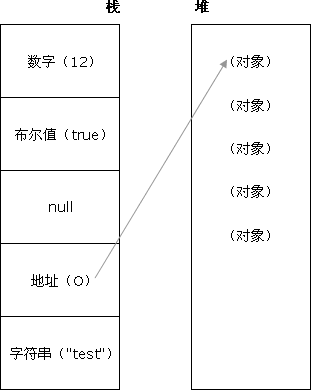

# JavaScript

---

<!--
🎟🤹‍🤹‍🎭🎬🎼🥁🎸🚗🚌🚁✈️🚀⛵️🚤🛥🛳⛴⛽️🚦🚥🚧🚏🗽🗼🏰🎠
⛱🏖🏝🏜🌋🏂🏋️‍🤸🏻‍🤸🏼‍⛹️‍⛹️‍🤺🏄‍🗝🛍🎁🎊🎉🎀🛍📦🎏📯📄🗞🔈📣
⛺️🗻🗻🏔⛰🏤🏥🌆🌁☎️🎥⏰🛢⚒⛏💎💰💡⌛️💣🔪⚙️💉🌡🛁🛀🏿🔑
🏄‍🏊‍🏊‍🚣‍🏆🚴‍🥇🥈🥉🏅🎖🎗🏵🎫🌊🍎🍋🍓🍇🍉🍅🍆🥝🌽🍖🍗
🐴🐌🐝🐋🐬🐅🐆🐳🐪🐘🐏🕊🐇🐓🦌🐎🐿🐉🐲🌸🌼🌻🌞🌝🍄🌾
🍥🍦🍭🎂🍭🍿🍩🍪🌰🥜🍺🍻☕️🍶🍷🥂🥃🍹🍾🏈🏀🥊⛳️🥋🎋🌱
🔕🔔🔊🗯💭🇨🇳🎍⭐️✨🌈🌚☄️💥🔥☀️🌤⛅️🌥☁️🌦🌧⛈🌩🌨❄️⛲️
🍱🍛 -->


## 1. JS Data Type 数据类型


### 1.1 js 的数据类型及他们的内存图示



- `栈`：原始数据类型(`undefined、boolean、null、Number、String、symbol`等)
- `堆`：引用类型(`数组、对象、函数`)

### 1.2 数据类型：原始数据类型(值)和引用类型

> 原始类型和引用类型的区别：
> 原始类型储存在`栈（Stack）`中储存变量的值 🎉 存储在栈中固定值常量
> 而引用类型在`栈中保存的是所引用内容储存在堆（Heap）中的值`。🎉 存储在堆中
> 类似于`指针`的概念，`引用类型并非储存变量真实数值而是地址`，所以`对已引用类型的复制其实只是复制了相同的地址而非实际的变量值`。

### 1.3 两种类型的区别是：存储位置不同存储方式不同

- `(值)原始数据类型直接存储在栈(stack)中的简单数据段，占据空间小、大小固定，属于被频繁使用数据，所以放入栈中存储`；
- `引用数据类型存储在堆(heap)中的对象,占据空间大、大小不固定,如果存储在栈中，将会影响程序运行的性能；引用数据类型在栈中存储了指针，该指针指向堆中该实体的起始地址。当解释器寻找引用值时，会首先检索其在栈中的地址，取得地址后从堆中获得实体。`

### 1.4 数据类型详解

```ts
1. null

  获取不存在的对象 document.getElementById('not-exist-element')

2. undefined

  以声明为赋值的变量 var obj;
  获取对象不存在的属性 var obj = {x: 0}; obj.y;
  无返回值函数的执行结果 function f(){}; var obj = f();
  函数参数没有传入 function f(i){console.log(i)}; f();
  void(expression)

3. String

  var str = 'Hello, world!';

4. Number

  整型直接量，八进制直接量（0-），十六进制直接量（0x-)，浮点型直接量 出现场景

5. Boolean

  条件语句导致的系统执行的隐式类型转换 if(隐式转换){}
  字面量或变量定义 var bool = true;

6. Object

7. Symbol [ ES6 ]
```

### 1.5 变量装换表

|   Value   | Boolean |  Number  | String            |
| :-------: | :-----: | :------: | ----------------- |
| undefined |  false  |   NaN    | "undefined"       |
|   null    |  false  |    0     | "null"            |
|   true    |  true   |    1     | "true"            |
|   false   |  false  |    0     | "false"           |
|    ""     |  false  |    0     | ''                |
|   '123'   |  true   |   123    | '123'             |
|   '1a'    |  true   |   NaN    | '1a'              |
|     0     |  false  |    0     | "0"               |
|     1     |  true   |    1     | "1"               |
| Infinity  |  true   | Infinity | "Infinity"        |
|    NaN    |  false  |   NaN    | 'NaN'             |
|    {}     |  true   |   NaN    | "[object Object]" |

### 1.6 🐯 区分数据类型

> 前言:
> `typeof` > `Object.prototype.toString` > `constructor`(少用) > `instanceof`

```ts
1. 👍👍Object.prototype.toString.call(T)

  - Array: "[object Array]"
  - String: "[object String]"
  - Object: "[object Object]"
  - Symbol: "[object Symbol]"
  - Number: "[object Number]"
  - Boolean: "[object Boolean]"
  - Function: "[object Function]"
  - RegExp: "[object RegExp]"
  - null: "[object Null]"
  - undefined: "[object Undefined]"
  - window[⚠️ !Window]:  "[object Window]" ⚠️

2. typeof(T)

  - Array: "object" ⚠️
  - String: "string"
  - Object: "object" ⚠️
  - Function: "function"
  - Number: "number"
  - Symbol: "Symbol"
  - Number: "number"
  - Boolean: "boolean"
  - Function: "function"
  - RegExp: "object" ⚠️
  - null: "object"  ⚠️
  - undefined: "undefined" 🙃
```

### 1.7 🙃 你所不知道的高级技巧（ : 常见错误和误区

```ts

🐯 声明多个标量应该使用逗号
  var a = 0, b //right
  let a = 0, b //right
  var a = 0; b //false
  let a = 0; b //false


  var a = {a: '23'}; var b = {a: '23'};
  a === b ||  a == b //  false

  null == null. null === null. // true
  undefined == undefined. undefined ===undefined. // true ⚠️

  typeof undefined // "undefined"
  typeof new RegExp('23232') // "object"
  typeof NaN // "number"
  typeof null // "object"

  null == null // true
  null === null // true

  undefined === undefined // true
  undefined == undefined // true

  null == undefined // true
  null === undefined //false

  ⚠️ NaN 谁也不等,就是这么
  NaN == NaN // false
  NaN === NaN // false

  Object.is(NaN, NaN) // true🐯🐯🐯

  Function instanceof Object // true 🐯🐯
  // 说明function是对象
```

### 1.8 🙃 为什么 typeof null 是 object

> 从逻辑角度来看，`null值表示一个空对象指针`，而这正是使用 typeof 操作符检测 null 值时会返回“object”的原因。《JavaScript 高级程序设计(第 2 版)》P22 如是说

**🙃: 娘胎里带出来的.**

> JS 类型值是存在 32 BIT 单元里,32 位有 1-3 位表示 TYPE TAG,其它位表示真实值 而表示 object 的标记位正好是低三位都是 0 000: object. The data is a reference to an object. 而 js 里的 Null 是机器码 NULL 空指针, (0x00 is most platforms).所以空指针引用 加上 对象标记还是 0,最终体现的类型还是 object..这也就是为什么 Number(null)===0 吧...

1. null 不是一个空引用, 而是一个原始值, 参考 ECMAScript5.1 中文版 4.3.11 节; 它只是期望此处将引用一个对象, 注意是"期望", 参考 null
2. typeof null 结果是 object, 这是个历史遗留 bug
3. 在 ECMA6 中, 曾经有提案为历史平凡, 将 type null 的值纠正为 null, 但最后提案被拒了. 理由是历史遗留代码太多, 不想得罪人, 不如继续将错就错当和事老

### 1.9 JavaScript 类型检测之 typeof 和 instanceof 的缺陷与优化

- typeof

typeof 返回一个表达式的数据类型的字符串，返回结果为 javascript 中的基本数据类型，包括：`number、boolean、string、object、undefined、function Symbol`等 7 种数据类型。

```ts
typeof 100 //number
typeof (1 == 1) //boolean
typeof 'onePixel' //string
typeof {} //object
typeof onePixel // undefined
typeof parseInt // function
typeof [] //object
typeof new Date() //object
```

可以看出，typeof 可以准确的判断除 object 以外的基础数据类型，但不能区分 object 类型的具体类型，比如 Array 、Date 以及自定义类。

- instanceof

```TS
String instanceof String //false
Object instanceof Object //true
Array instanceof Array //false
'' instanceof String // false

[1,2] instanceof Array //true
Date instanceof Date //false
'2' instanceof String //false
RegExp instanceof RegExp //false
```

> instanceof 本意是用来判断 A 是否为 B 的实例对象，表达式为：A instanceof B，如果 A 是 B 的实例，则返回 true,否则返回 false。 在这里需要特别注意的是：instanceof 检测的是原型，那它是怎么检测的呢，我们用一段伪代码来模拟其内部执行过程：

```TS
instanceof (A,B) = {
  var L = A.__proto__;
  var R = B.prototype;
  if(L === R) {
  //A的内部属性__proto__指向B的原型对象
  return true;
  }
  return false;
}
```

从上述过程可以看出，当 A 的**proto** 指向 B 的 prototype 时，就认为 A 就是 B 的实例对象，我们再来看几个例子：

```js
  [] instanceof Array; //true
  {} instanceof Object;//true
  new Date() instanceof Date;//true
  function Person(){};
  new Person() instanceof Person;
  [] instanceof Object; //true
  new Date() instanceof Object;//true
  new Person instanceof Object;//true

🐯 🐯 🐯
  var a = '' ; a instanceof String //false

  a = new String('2')// String {"2"}
  a instanceof String //true

  Number instanceof Number //false

  b = new Number('23')
  b instanceof Number // true

  23 instanceof Number // false

  /\d/i instanceof RegExp // true

  a = {}
  a instanceof Object // true
```

从上面的例子中，我们发现虽然 instanceof 能够正确判断[] 是 Array 的实例对象，但不能辨别 [] 不是 Object 的实例对象，为什么呢，这还需要从 javascript 的原型链说起，我们首先来分析一下[]、Array、Object 三者之间的关系，从 instanceof 判断能够得出：[].**proto** ->Array.prototype， 而 Array.prototype.**proto**指向了 Object.prototype，Object.prototype.**proto** 指向了 null,标志着原型链的结束。（ps:关于 JS 原型链请阅读：浅谈 javascript 原型和原型链） 因此，[]、Array、Object 就形成了一条原型链：


从原型链可以看出，[]的**proto**最终指向了 Object.prototype，类似的 new Date()、new Person() 也会形成这样一条原型链，因此，我们用 instanceof 也不能完全精确的判断 object 类的具体数据类型。

## 2. JS Error System 错误系统

🐯🙃🏃🎉⚠️


### 2.1 ⚠️js 中包含的错误详细解释

```ts
  SyntaxError: 语法错误
  ReferenceError: 引用错误 要用的东西没找到
  RangeError: 范围错误  专指参数超范围
  TypeError: 类型错误  错误的调用了对象的方法
  EvalError: raised when an error occurs executing code in eval()  eval函数调用失败
  URIError: raised when encodeURI() or decodeURI() are passed invalid parameters 编码错误
```

### 2.3 以下在浏览器可抛出错误

```ts
throw new SyntaxError('I dont like your syntax')

throw new TypeError('What type of variable do you take me for?')

throw new RangeError('Sorry, you just dont have the range')

throw new EvalError('That does‘nt evaluate.')

throw new URIError('Uri, is that you?')

throw new ReferenceError('You didn’t cite your references properly')
```

### 2.4 错误捕捉和错误处理

- try-catch

  错误处理在程序设计中的重要性是一定的。任何有影响力的 Web 应用程序都需要一套完善的错误处理机制。

```ts
try {
  // 可能会导致错误的代码
} catch (e) {
  // 在错误发生时怎么处理
}
```

- window.onerror

```ts
window.onerror = function(message, url, line) {
  // 处理错误
}
```

## 3. String 字符串

### 3.1 常用方法

`Important`

```ts
🎉 slice [start, stop( 不包含此位置的字符串 )] 用于从原来字符串中取出子字符串并返回新的.

  - 有 2 个参数,第 1 个参数子字符串的起始位置,第 2 个参数子字符串的结束位置(不包含该位置)

    var str7 = "hello world";
    var res14 = str7.slice(1,3);//'el'

  - 1 个参数 如果省略 slice()中的第二个参数,则表示子字符串一直到整个字符串结束为止.

    var res15 = str7.slice(1);// 'ell0 world'

  - 如果该函数只有一个参数,且为负数,则从字符串结尾开始(从右向左)计算位置

    var res16 = str7.slice(-5);//world

  - 如果该函数的第一个参数大于第二个参数,则返回一个空的字符串

    var res17 = str7.slice(12,5);//返回一个空字符串""

🎉 substring [ start, stop(不包含) ] 之间的新的字符串

    从原字符串中取出子字符串,跟slice使用一样.但是我们一般优先使用slice函数

  - 如果该函数的第一个参数大于第二个参数,系统会自动调换 2 个参数的位置

    var str8 = "helloWorld";
    var res18 = str8.substring(0,2);// 'he'
    var res18 = str8.substring(2,0);// 'he'

  - 如果函数参数中有负数,系统会把负数转换为 0

    var res20 = str8.substring(0,-4);//会把-4 变成 0 返回空字符串""; 等效于 str8.substring(0,0)

🎉🎉🎉 substr [start,length] 开始位置起的指定长度新的字符串

  - 省略第二个参数 表示一直到字符串结束

        var res22 = "abcdef".substr(4);//ef

  - 如果第一个参数是负数,表示从右向左确定字符串的起始位置

    var res23 = "abcdef".substr(-2);//ef

  - 该函数两个参数,第二个参数值是负数,则会自动转换为 0

    var res24 ="abcdefg".substr(2,-3);//"",第二个参数-3 会变成 0
    //等效于"abcdefg".substr(2,0)

🎉 🎉 split() 把字符串分割为字符串数组
  var  res23 = "abcdef".split('');// ['a',"b","c","d","e","f"]
```

### 3.2 属性和方法

- 3.2.1 创建字符串 `New String( ) / "string"/ + 连接符`

```TS
 let demo1 = new String("hello world")
 let demo2 = "hello world"
 let demo3 = '223' + 22  //转换 + 为字符串连接符号 ''22322''
```

- 3.2.2 String.fromCharCode

```TS
  var str = String.fromCharCode(0x12,0x45,0x67,0x122,0xfe,0x23);
  1.该方法中的参数是一系列unicode的码点(例如:'\u0012' 码点:0012),返回对应的字符串.
  2.传入参数的值不能超过0xFFFF大小
  3.该方法定义在对象本身,而不是创建对象实例方法上面

  #: String.fromCharCode而不是str.fromCharCode
```

- 3.2.3 作用于实例对象的方法和属性

```TS
1. length 返回字符串的长度 : string.length

2. charAt 返回指定位置的字符,参数从0开始

( 这个方法等效于用数组下标方式来返回字符,
如果参数为负或者超过字符的长度,charAt()返回空字符串)

str = 'hello'
str.charAt(2) == 'l'
str.charAt(-1) ||  str.charAt(7)  === ''# 空字符串

3. charCodeAt 该函数返回给定位置字符Unicode的码点(10进制表示),刚好是String.fromCharCode()的逆操作.

var str2 = "acd";
var result2 = str2.charCodeAt(2);//d字符码点:100
var resu2 = String.fromCharCode(100);//把100转换为Unicode字符d

4.concat 用于连接两个字符串,返回一个新的字符串

- concat()中的参数可以写1个或者多个字符串
var str3 = "hello";
var str4 = "world";
var str5 = "zhang";
var str6 ="san";
var res10 = str3.concat(str4);
var res11 = str3.concat(str4,str5,str6);

- 该方法的字符串连接等效于+连接符
var res12 = "abc".concat("a","b","c");//abcabc
var res13 = "abc"+"a"+"b"+"c";//abcabc

🎉 5. slice [start, stop( 不包含此位置的字符串 )] 用于从原来字符串中取出子字符串并返回新的.

- 有2个参数,第1个参数子字符串的起始位置,第2个参数子字符串的结束位置(不包含该位置)

var str7 = "hello world";
var res14 = str7.slice(1,3);//'el'

- 1个参数 如果省略slice()中的第二个参数,则表示子字符串一直到整个字符串结束为止.

var res15 = str7.slice(1);// 'ell0 world'

- 如果该函数只有一个参数,且为负数,则从字符串结尾开始(从右向左)计算位置

var res16 = str7.slice(-5);//world

- 如果该函数的第一个参数大于第二个参数,则返回一个空的字符串

var res17 = str7.slice(12,5);//返回一个空字符串""

🎉 6. substring [ start, stop(不包含) ] 之间的新的字符串
#: 从原字符串中取出子字符串,跟slice使用一样.但是我们一般优先使用slice函数

- 如果该函数的第一个参数大于第二个参数,系统会自动调换2个参数的位置

var str8 = "helloWorld";
var res18 = str8.substring(0,2);// 'he'
var res18 = str8.substring(2,0);// 'he'

- 如果函数参数中有负数,系统会把负数转换为0

var res20 = str8.substring(0,-4);//会把-4变成0 返回空字符串""; 等效于str8.substring(0,0)


🎉 7. substr [start,length] 开始位置起的指定长度新的字符串
  - 省略第二个参数 表示一直到字符串结束

  var res22 = "abcdef".substr(4);//ef

  -  如果第一个参数是负数,表示从右向左确定字符串的起始位置

  var  res23 = "abcdef".substr(-2);//ef

  - 该函数两个参数,第二个参数值是负数,则会自动转换为0

  var res24  ="abcdefg".substr(2,-3);//"",第二个参数-3会变成0
  //等效于"abcdefg".substr(2,0)


8. indexOf()  lastIndexOf()

- 这两个方法用于确定一个字符串在另外一个字符串中的起始位置.都返回一个整数(位置一定是从左到右算起的).表示匹配的开始位置.如果返回-1表示不匹配.

- 两者的不同,indexOf()从字符串的头部开始匹配;lastIndexOf()从字符串的尾部开始匹配

  var stri = "assessd".indexOf("ss");//1
  var stri1 ="assessd".lastIndexOf("ss");//4

9. trim 去除两边空格 ' trung'.trim() // "trung"

10. replace 方法用于在字符串中用一些字符替换另一些字符，或替换一个与正则表达式匹配的子串。

11. match()  找到一个或多个正则表达式的匹配。
12. search()  检索与正则表达式相匹配的值。
13. split()  把字符串分割为字符串数组。

  str.split('')
  str.split(/\s+//g) # 以空格分割

14. toLocaleLowerCase()  把字符串转换为小写。
15. toLocaleUpperCase()  把字符串转换为大写。toString()  返回字符串。
20. valueOf()  返回某个字符串对象的原始值。
```

## 4. Array 数组

🐯🙃🏃🎉⚠️

### 4.1 🙃Question

- 如何区分 array?

```ts
1. instanceof 判断数组：
function isArray(obj) {
  return obj instanceof Array;
}
// 缺陷 答案就是 instanceof 无法判断跨 frame 的数组类型：
var iframe = document.createElement('iframe');
document.body.append(iframe);
var FrameArray = window.frames[window.frames.length-1].Array;
var array = new FrameArray();
console.log(array instanceof Array);
// false


2. Array.isArray // ES6 的这个方法可以解决上面跨iframe的问题

3. Object.prototype.toString.call() // [object Array]
```

- 如何实现一个高阶函数 `reduce` 和 `map` ? ⚠️⚠️ 不能是箭头函数 否则 this 指向 window

```ts
1. reduce // ⚠️ 未容错

Array.prototype._reduce = function(cb, /* initValue */){
  const arr =Object(this)
  const length = arr.length
  const hasInit = arguments.length  > 1
  let res = hasInit ? arguments[1] : arr[0]
  let start = hasInit ? 0 : 1
  for (let i = start;i < length; i ++ ) {
    res = cb(res, arr[i], i, arr)
  }
  return res
}


2. map ⚠️ 引用类型元素会出现问题

Array.prototype._map = function(callback, thisValue) {
  console.info(arguments[1])
  const getType = (s) => {
    return Object.prototype.toString.call(this)
  }
// ⚠️ 不能是箭头函数 否则this 指向window
// Array.prototype._map.call(null || undefined ) 则 this 指向 window
  if (this === null || this === undefined || getType(this) === "[object Window]" ) {
    throw new Error('null or undefined or window is  invalid')
  }

  if (typeof callback !== "function") {
    throw new Error('expect parameter is function, but not')
  }

  if (Object.prototype.toString.call(this) !== "[object Array]") {
    throw new Error('expect Array is function, but not')
  }

  if (arguments.length > 1) {
    thisArg = arguments[1]
  }

  const sourceArray = [...this] // deepClone
  const length = sourceArray.length
  if (length === 0 ) {
    console.info('empty array')
    return []
  }


  const targetArray = []

  for(let i = 0; i < length; i++) {
    targetArray[i] = callback.call(thisArg,sourceArray[i], i, sourceArray )
  }

  return targetArray

}


3. filter

Array.prototype._filter= function(callback, /*thisValue*/) {

  if (arguments.length > 1) {
    thisArg = arguments[1]
  }

  const sourceArray = [...this] // deepClone
  const length = sourceArray.length

  if (length === 0 ) {
    console.info('empty array')
    return []
  }


  const targetArray = []

  for(let i = 0; i < length; i++) {
    if (callback.call(thisArg, sourceArray[i], i, sourceArray )) {
      targetArray.push(sourceArray[i])
    }
  }

  return targetArray

}

4. some
Array.prototype._some= function(callback, /*thisValue*/) {

  if (arguments.length > 1) {
    thisArg = arguments[1]
  }

  const sourceArray = [...this] // deepClone
  const length = sourceArray.length

  if (length === 0 ) {
    console.info('empty array')
    return false
  }


  const targetArray = []
  let res = false

  for(let i = 0; i < length; i++) {
    if (callback.call(thisArg, sourceArray[i], i, sourceArray )) {
      res = true
      break
    }
  }
  return res

}

```

### 4.2 🏃Other ES6

```ts
1. 剩余操作符之展开一层
[...[1,2], 3,4, ...[5,6]] // [1,2, 3,4, 5,6]
(...[[1,2], 3,4, [5,6]]) // (...[[1,2], 3,4, [5,6]])
```

### 4.3 🏃 必知必会

`Import`

```ts
🐯🐯1.  array.sort([function(a, b)]) 更改了原数组
对数组的元素做原地的排序，并返回 ⚠️这个数组。sort可能不稳定，默认按照字符串的unicode码位点排序

记a和b是两个将要被比较的元素：
如果函数function（a， b）返回值小于0， 则 a 会排在 b 之前
如何函数返回值等于0， 则a和b的相对位置不变（并不被保证）
如果函数返回值大于0，则 a 会排在 b 之后
比较函数输出结果必须稳定，否则排序的结果将是不确定的

🐯🐯2. array.splice(start, deleteCount[, item1[, item2...]) 更改了原数组
在任意的位置给数组添加或删除任意个元素（拼接），返回被删除的元素组成的数组，没有则返回空数组

start: 开始操作的索引
deleteCount：要移除的数组元素的个数
itemN:要添加进数组的元素，如果不指定，则splice只删除数组元素
a =[0,1,2,3,4]
a.splice(0,0,9) // [9, 0, 1, 2, 3, 4]


🐯3. array.reduce(callback, [initialValue])

🐯callback = (prev, item, index, arr) => {}
该方法接收一个函数作为累加器（accumulator），数组中的每个值（从左到右）开始合并，最终为一个值
callback参数：
  previousValue:上一次调用回调返回的值，或者是提供的初始值（initialValue）
  item: 数组中当前被处理的元素
  index： index
  arr: 调用的数组
如果 initialValue 在调用 reduce 时被提供，那么第一个 previousValue 等于 initialValue ，并且currentValue 等于数组中的第一个值；如果initialValue 未被提供，那么previousValue 等于数组中的第一个值，currentValue等于数组中的第二个值。
一个例子

  [0, 1, 2, 3, 4, 5].reduce((prev, item, index , arr) => {
    return prev + item
  }) //15

  数组扁平化：
  var flattened = [[0, 1], [2, 3], [4, 5]].reduce((a, b) => {
    return a.concat(b)
  })
  //flattened is [0, 1, 2, 3, 4, 5]

```

### 4.4 ️ 🐯 改变自身的方法

```ts
1. array.pop()
删除一个数组中的最后一个元素，并且返回这个元素

2. array.push(element1, ...elementN, elementArray1)
添加一个或多个元素到数组的末尾，并返回数组新的长度

3. array.shift()
删除数组的第一个元素，并返回这个元素

4. array.unshift()
在数组的开头插入一个或多个元素，并返回数组的新长度

5. array.reverse()
前后颠倒数组中元素的位置，第一个元素会成为最后一个

🎉6. array.sort([function(a, b)])
对数组的元素做原地的排序，并返回这个数组。sort可能不稳定，默认按照字符串的unicode码位点排序

记a和b是两个将要被比较的元素：

如果函数function（a， b）返回值小于0， 则a会排在b之前
如何函数返回值等于0， 则a和b的相对位置不变（并不被保证）
如果函数返回值大于0，则 a 会排在 b 之后
比较函数输出结果必须稳定，否则排序的结果将是不确定的

🎉7. array.splice(start, deleteCount[, item1[, item2...]) 返回新数组🎉
在任意的位置给数组添加或删除任意个元素（拼接），返回被删除的元素组成的数组，没有则返回空数组

start: 开始操作的索引
deleteCount：要移除的数组元素的个数
itemN:要添加进数组的元素，如果不指定，则splice只删除数组元素
a =[0,1,2,3,4]
a.splice(0,0,9) // [9, 0, 1, 2, 3, 4]

8**. array.copyWithin（target, start [, end = this.length]）【有兼容性问题】
用于在数组内的替换操作，即替换元素和被替换元素都是数组内的元素
参数皆为整数，允许start，end为负数（倒数第n个）

9**. array.fill(value [, start = 0[, end = this.length]])
将数组中指定区间的所有元素的值，都替换成value
start，end允许为负值，同上
```

### 4.5 🎉 不改变自身的

```ts
1. array.concat(value1, value2.....) 浅复制,引入类型干扰 将传入的数组或非数组值与原数组合并，组成一个新的数组并返回
⚠️ ⚠️ ⚠️Notice: 注意：concat方法在拷贝原数组的过程中， 对象引用（非对象直接量）：concat方法会复制对象引用放到组合的新数组里，原数组和新数组中的对象引用都指向同一个实际的对象，所以，当实际的对象被修改时，两个数组也同时被修改
字符串和数字（是原始值，而不是包装原始值的 string 和 number 对象）：concat方法会复制字符串和数字的值放到新数组里
一个栗子：

var arr1 = [1, 2, {a: 'test'}]
var arr2 = ['a', 'b', 'c']
var output = arr1.concat(arr2)
console.log(output) // output[2].a == 'test'
setTimeout(function(){
        arr1[2].a = 'has changed'
        console.warn(output)  //output[2].a == 'has changed'
}, 5000)

var alpha = ['a', 'b', 'c']
var output = alpha.concat(1, [2, 3]) //['a', 'b', 'c', 1, 2, 3]

2. array.includes(searchElement, [, fromIndex])[实验性质，es7，可能会改变或删除]
用来判断当前数组是否包含某指定的值，如果是，则返回true，否则false

3. array.join([separator = ','])

将数组中的所有元素连接成一个字符串(默认用逗号作为分隔符，如果separator是一个空字符串，那么数组中的所有元素将被直接连接)
⚠️ ⚠️ ⚠️如果元素 是undefined 或者 null，则会转化成空字符串
  [12,123,undefined, null].join('-') // "12-123--"

4. array.slice([begin = 0 [ stop = this.length - 1]])
⚠️ 返回一个新的数组，包含从 start 到 end （不包括该元素）的 arrayObject 中的元素。
请注意，该方法并不会修改数组，而是返回一个子数组。如果想删除数组中的一段元素，应该使用方法 Array.splice()。


把数组中一部分的浅复制（shallow copy）存入一个新的数组对象中，并返回这个新的数组
不修改原数组，只会返回一个包含了原数组中提取的部分元素的一个新数组
具体拷贝规则同concat函数
注释：您可使用负值从数组的尾部选取元素。

注释：如果 end 未被规定，那么 slice() 方法会选取从 start 到数组结尾的所有元素。⚠️

5. array.toString() 返回
返回一个字符串，该字符串由数组中的每个元素的[自身的 toString toString() 返回值经调用join（）方法连接（由逗号隔开）组成。

一个例子：

 var arr = ['abc', 2, {a: 'test'}]
 ⚠️ console.log(arr.toString())        //'abc,2,[object Object]'

6. array.toLocaleString()
返回一个字符串表示数组中的元素。数组中的元素将使用各自的toLocaleString方法转化成字符串，这些字符串将使用一个特定语言环境的字符串（例如逗号）隔开

7. array.indexOf(searchElement[, fromIndex = 0])
返回指定元素能在数组中找到的第一个索引值，否则返回-1
fromIndex可以为负，表示从倒数第n个开始（此时仍然从前向后查询数组）
使用“严格相等”（===）进行匹配

一个例子：

          var obj = {a: 'test'}
          var arr = ['a', 'b', {a: 'test'}]
          console.log(arr.indexOf(obj))     //-1

          var arr2 = [1, 'b', {a: 'test'}]
          console.log(arr2.indexOf('1'))      //-1
8. array.lastIndexOf(searchElement[, fromIndex = arr.length - 1])
返回指定元素在数组中的最后一个的索引，如果不存在则返回-1， 从数组的后面向前查找
同上
```

### 4.6 🏃 高阶函数

`[不会影响原数组,但是引用类型的问题仍然存在]`

```ts

1. array.forEach(callback = (item, index, arr) => {})

让数组的每一项都执行一次给定的函数
v表示当前项的值，i表示当前索引，a表示数组本身
forEach遍历的范围在第一次调用 callback前就会确定。调用forEach后添加到数组中的项不会被 callback访问到。如果已经存在的值被改变，则传递给 callback的值是 forEach遍历到他们那一刻的值。已删除的项不会被遍历到。

2. array.entries()

返回一个Array Iterator对象，该对象包含数组中每一个索引的键值对
一个例子：

var arr = ["a", "b", "c"];
var eArr = arr.entries();

console.log(eArr.next().value); // [0, "a"]
console.log(eArr.next().value); // [1, "b"]
console.log(eArr.next().value); // [2, "c"]

3. array.every(callback = (item, index, arr) => {})

callback只会为那些已经被赋值的索引调用，不会为那些被删除或从来没有被赋值的索引调用和forEach函数类似
// array.every()返回一个布尔值，即对每个元素的callback函数结果作逻辑“&”操作

3. array.some(callback = (item, index, arr) => {})

使用方法同上，//注意：对每个元素的callback函数结果作逻辑“||”操作

4. array.filter(callback = (item, index, arr) => {})

使用指定的函数测试所有元素，并创建一个包含所有测试通过的元素的新数组
callback函数返回一个布尔值，true即通过测试
callback只会在已经赋值的索引上被调用，对于那些已经被删除或者从未被赋值的索引不会被调用 //不会改变原数组

5. array.find(callback = (item, index, arr) => {})【有兼容性问题目前】

返回数组中满足测试条件的第一个元素，如果没有满足条件的元素，则返回undefined

6**. array.keys()
返回一个数组索引的迭代器（类似于array.entries()方法）

7. array.map(callback = (item, index, arr) => {})
返回一个由原数组中的每个元素调用一个指定方法后的返回值组成的新数组
map 不修改调用它的原数组本身（当然可以在 callback 执行时改变原数组）

🎉🎉🎉8. array.reduce(callback, [initialValue])

🐯🐯🐯callback = (prev, item, index, arr) => {}
该方法接收一个函数作为累加器（accumulator），数组中的每个值（从左到右）开始合并，最终为一个值
callback参数：
  previousValue:上一次调用回调返回的值，或者是提供的初始值（initialValue）
  item: 数组中当前被处理的元素
  index： index
  arr: 调用的数组
如果 initialValue 在调用 reduce 时被提供，那么第一个 previousValue 等于 initialValue ，并且currentValue 等于数组中的第一个值；如果initialValue 未被提供，那么previousValue 等于数组中的第一个值，currentValue等于数组中的第二个值。
一个例子

[0, 1, 2, 3, 4, 5].reduce((prev, item, index , arr) => {
  return prev + item
}) //15

数组扁平化：
var flattened = [[0, 1], [2, 3], [4, 5]].reduce((a, b) => {
  return a.concat(b)
})
//flattened is [0, 1, 2, 3, 4, 5]

9. array.reduceRight()
使用同上，与reduce（）的执行方向相反

```
